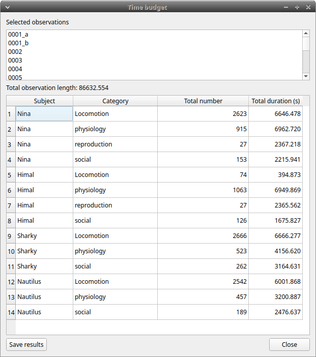
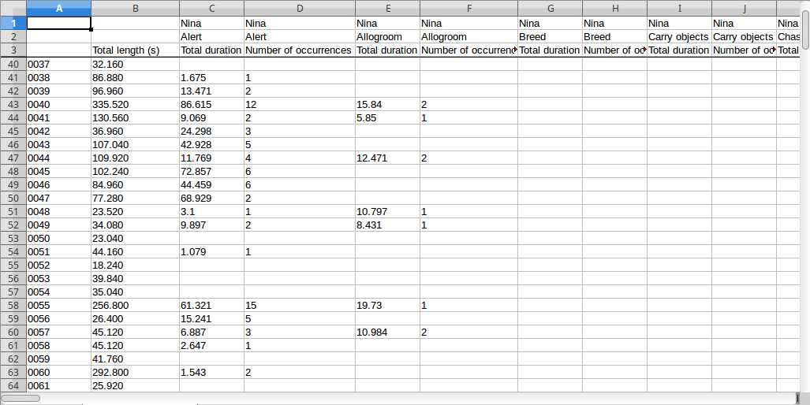
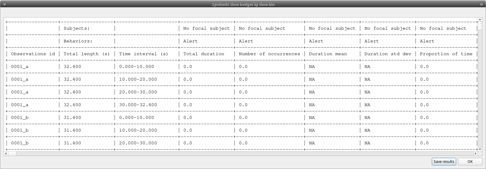
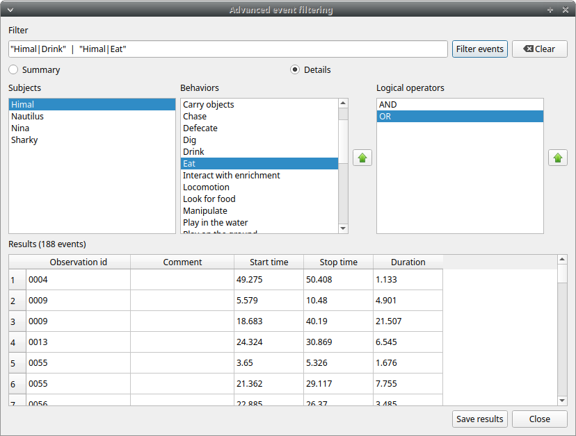
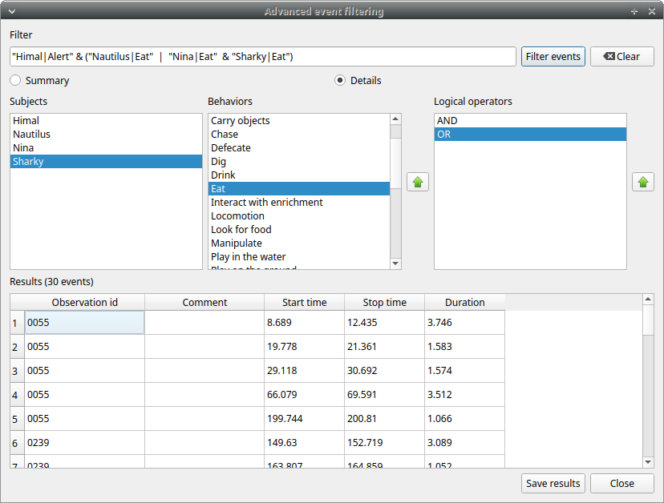
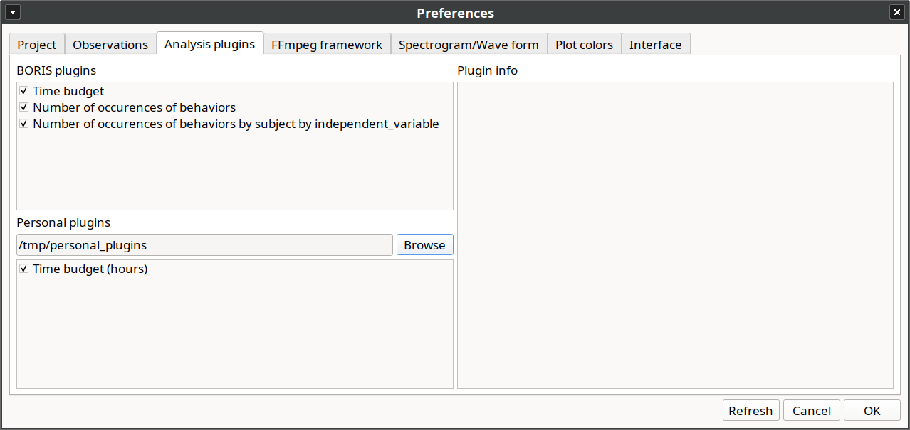
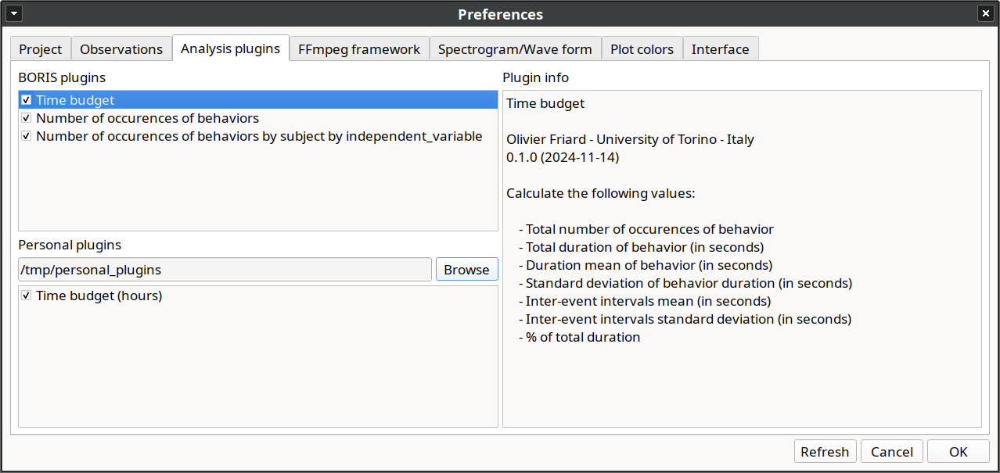
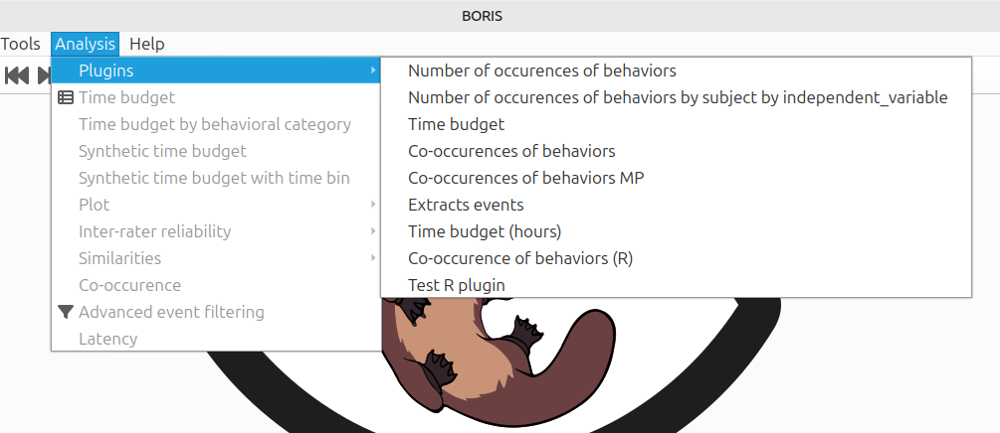
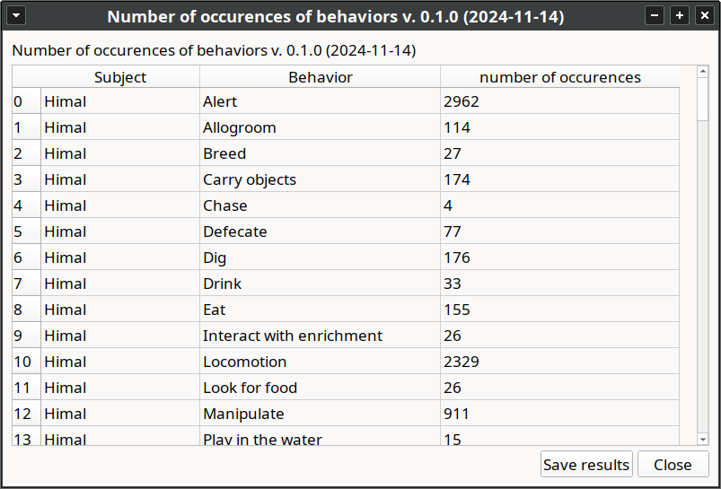

# Analysis and plot

## Time budget analysis

The **Time budget analysis** can be done by behavior (including or not
the modifiers) or by category of behaviors. Choose the option from the
**Analysis** menu.

The **Time budget analysis** can be done on one or more observations. If
you select more than one observation you must then choose for a global
time budget analysis that will contain all selected observations or a
time budget analysis for every single observation.

Choose **Yes** to group all observations in one time budget analysis

The **Analysis** \> **Time budget** menu option shows the time budget
for the events of the selected observations. Select the subjects and
behaviors you want to include in the time budget analysis:

All behaviors can be selected or unselected by clicking on the Category (bold).

You can choose to include or not the behavior modifiers in the Time
budget analysis and to exclude behaviors without coded events.

The Time budget analysis can be restricted to a part of the observation:

-   Full observation(s): the analysis will be made on the full
    observation length.
-   Limit to time interval: use the **Start time** and **End time**
    boxes to select starting time and ending time.
-   Limit to observed events: the analysis will be made from the first
    observed event to the last observed event.

The last dialog window will allow you to subtract the duration of one or
more behaviors from the total duration of the observation. This can help
you if you have defined a "out-of-sight" code in your ethogram for example:

The results contain for each subject and behavior the **total nuber of
occurrences**, the **total duration** (for the behaviors defined as
state events), The **duration mean** (for the behaviors defined as state
events), the **standard deviation of duration**, the **inter-events
intervals duration mean**, th **standard deviation of the inter-events
intervals duration** and the **percent of total duration of
observation(s)**. All duration times are expressed in seconds (s).

<figure markdown>
  
  <figcaption>Results of the time budget analysis</figcaption>
</figure>

The time budget results can be saved in various formats for further
analysis:

- Plain text in tabular format
    - **Tab Separated Values** (TSV)
    - **Comma Separated Values** (CSV)
    - **Hyper Text Markup language** (HTML)

- Spreadsheet files
    - **OpenDocument** (ODS)
    - **Microsoft Excel** (XLSX, XLS)
    
-  **Pandas dataframe** (to be loaded in Python with the [pickle
    module](https://docs.python.org/3/library/pickle.html))

-   **R dataframe** (to be loaded in R with [readRDS
    function](https://rdrr.io/r/base/readRDS.html))

!!! warning "Important"

    If a STATE behavior has an odd number of coded events, BORIS will report **UNPAIRED** instead of results.

## Time budget by behavioral category

The **Time budget by behavioral category** is similar to the [**Time budget analysis**](analysis.md#time-budget-analysis) 
except that the behaviors are grouped into **behavioral categories**.

<figure markdown>
  
  <figcaption>Results of a time budget by behavioral category analysis</figcaption>
</figure>

## Synthetic time budget

The synthetic time budget is similar to time budget but with fewer
parameters and a different organization of results. Results of all
selected observations are organized in columns on a single page. Two
parameters are provided for now: **number of occurrences** and **total
duration** (for the behaviors defined as state events)

All duration times are expressed in seconds (s).

The time budget results can be saved in various formats for further analysis:

- Plain text in tabular format
    - **Tab Separated Values** (TSV)
    - **Comma Separated Values** (CSV)
    - **Hyper Text Markup language** (HTML)

- Spreadsheet files
    - **OpenDocument** (ODS)
    - **Microsoft Excel** (XLSX, XLS)

## Synthetic time budget with time bin

The **synthetic time budget with time bin** is similar to the **Synthetic time budget** but the results are divised in time bin.

**Analysis** > **Synthetic time budget with time bin** 

Choose a time bin size (in seconds)

<figure markdown>
  
  <figcaption>Time bin size of 10 seconds</figcaption>
</figure>

<figure markdown>
  
  <figcaption>Results of a Synthetic time budget with time bin of 10 seconds</figcaption>
</figure>

The **time budget with time bin** results can be saved in various formats for further analysis:

- Plain text in tabular format
    - **Tab Separated Values** (TSV)
    - **Comma Separated Values** (CSV)
    - **Hyper Text Markup language** (HTML)

- Spreadsheet files
    - **OpenDocument** (ODS)
    - **Microsoft Excel** (XLSX, XLS)

## Inter-rater reliability

The Cohen's kappa coefficient can be calculated (**Analysis** > **Inter-rater reliability** > **Cohen\'s kappa**).

[Cohen's kappa on Wikipedia](https://en.wikipedia.org/wiki/Cohen%27s_kappa)

After selecting 2 observations and a time window (in seconds) for the
analysis (the default value is 10 seconds) the Cohen's kappa will be
displayed in the results window.

### Implementation of IRR Cohen's Kappa in BORIS

If a time window of n seconds is set the 2 selected observations will be
checked every n seconds for agreement/disagreement from the first event
to the last event of the 2 observations . In case of a point event the
presence of a corresponding event in the other observation will be
verified using a time window of n seconds centered on the point event.

A IRR Cohen's Kappa analysis is available in the GSEQ program
(<http://www2.gsu.edu/~psyrab/gseq>). For this the coded events can be
exported as aggregated events in SDIS format.
See [export aggregated events](export_events.md#export-aggregated-events).

## Similarities

Needleman-Wunsch similarity

## Co-occurence

This function allow to determine the co-occurence of 2 behaviors.

## Advanced event filtering

This function allows to filter events from one or more observations by
selecting subjects, behaviors and logical operators.

To use the filter, select a subject, select a behavior and click on the
button with the green arrow on the side of the behaviors list. The tuple
subject/behavior will be added in the **filter text edit**. A complex
filter query can be constructed by adding parenthesis and logical
operator **&** (AND) or **|** (OR) for combining various subjects and behaviors.

Example of a summarized output showing the occurences of Himal resting
while Nautilus in alert:

Example of a detailed output showing the overlaping intervals while
Himal rests and Nautilus is in alert:

The same subject can be used many times in the query with OR or AND (in case of non exclusive behaviors):

An unlimited number of conditions can be used:

Parenthesis can be used to group logical conditions into block(s):

The results can be saved in a Tab Separted Values (TSV) file using the
**Save results** button. Other formats will be added in future.

## Latency

The latency will analyze the time between one or more markers (arbitrary behaviors(s)) and other behaviors.

## Plugins

Starting from version 9, you can create plugins to analyze coded data.
BORIS supports two programming languages for writing plugins: **Python** and **R**.

!!! warning "Important"

    Use this function for testing purposes, as it is currently experimental and may be subject to changes in the future.

Some plugins are built into BORIS (see the **BORIS plugins** list), and you can also create your own custom plugin using Python and [Pandas](https://pandas.pydata.org/) or R.

Go to **Preferences** > **Analysis plugins**, then choose the plugins you'd like to enable.

You can view more information by clicking on the plugin name.

You can find the plugin code in the boris/analysis_plugins directory.

### How to use an Analysis plugin

Go to **Analysis** > **Plugins**

All plugins are listed (the BORIS plugins and your personal plugins)

Select the plugin you want to use

Select the observations to analyze

Select the subjects and the behaviors

You should obtain a window with the results of the plugin analysis

The results can be saved in various formats (TSV, CSV, ODS, XLSX, Pandas dataframe, R dataframe and HTML)

### Anatomy of an Analysis plugin

The DataFrame passed to the plugin includes the following columns:

    Column                                              Dtype  
     ------                                              -----  
    Observation id                                      object 
    independent variables                               object 
    ...
    Subject                                             object 
    Observation duration by subject by observation      int64  
    Behavior                                            object 
    Behavioral category                                 object 
    Behavior modifiers                                  object
    ...
    Behavior type                                       object 
    Start (s)                                           object 
    Stop (s)                                            object 
    Duration (s)                                        object 
    Comment start                                       object 
    Comment stop                                        object 

The DataFrame will include a column for each independent variable defined in your project.

The DataFrame will include a column for each behavior modifier set defined in your project.

Here is an example of the DataFrame structure, including 4 independent variables and various behavior modifiers:

    Data columns (total 27 columns):
    #   Column                                              Dtype  
    ---  ------                                              -----  
    0   Observation id                                      object 
    1   independent variable 'Location'                     object 
    2   independent variable 'Weather'                      object 
    3   independent variable 'Temperature'                  object 
    4   independent variable 'Number of visitors'           object 
    5   Subject                                             object 
    6   Observation duration by subject by observation      int64  
    7   Behavior                                            object 
    8   Behavioral category                                 object 
    9   (Carry objects, set #1)                             object 
    10  (Chase, set #1)                                     float64
    11  (Eat, set #1)                                       float64
    12  (Eat, set #2)                                       float64
    13  (Interact with enrichment, set #1)                  float64
    14  (Locomotion, set #1)                                object 
    15  (Play in the water, interaction)                    object 
    16  (Play on the ground, set #1)                        object 
    17  (Rub, set #1)                                       object 
    18  (Sniff, set #1)                                     object 
    19  (Spot keeper, set #1)                               float64
    20  (Tear, set #1)                                      object 
    21  Behavior type                                       object 
    22  Start (s)                                           object 
    23  Stop (s)                                            object 
    24  Duration (s)                                        object 
    25  Comment start                                       object 
    26  Comment stop                                        object 

#### Python plugin

A BORIS Python plugin is a Python script consisting of one function **run**.

The **run** function takes a Pandas DataFrame as its sole argument and must return:

* a **Pandas DataFrame**.
* a **string** (str)
* a **Pandas DataFrame** and a **string** (str) as a tuple.

For example:

    def run(df: pd.DataFrame) -> pd.DataFrame:
       ...
       ...
       return elaborated_df

or:

    def run(df: pd.DataFrame) -> str:
       ...
       ...
       return results

or:

    def run(df: pd.DataFrame) -> tuple[pd.DataFrame, str]:
       ...
       ...
       return (elaborated_df, results)

The plugin code must define the following global variables:

    __plugin_name__ = "PLUGIN NAME"
    __version__ = "x.y.z"
    __version_date__ = "YYYY-MM-DD"
    __author__ = "AUTHOR - INSTITUTION"

Example of Python plugin for determining the number of occurences of the selected behaviors for each selected subjects:

    """
    BORIS plugin

    number of occurences of behaviors
    """

    import pandas as pd

    __version__ = "0.3.0"
    __version_date__ = "2025-03-17"
    __plugin_name__ = "Number of occurences of behaviors"
    __author__ = "Olivier Friard - University of Torino - Italy"

    def run(df: pd.DataFrame) -> pd.DataFrame:
        """
        Calculate the number of occurrences of behaviors by subject.
        """

        df_results: pd.DataFrame = df.groupby(["Subject", "Behavior"])["Behavior"].count().reset_index(name="number of occurences")

        return df_results

Visualize the plugin code on GitHub: [number_of_occurences.py](https://github.com/olivierfriard/BORIS/blob/pyside6/boris/analysis_plugins/number_of_occurences.py)

You can modify the **run** function to implement your custom logic.

#### R plugin

The plugin written with R must contain a **run** function. 
The **run** function takes a dataframe as its sole argument and must return a dataframe:

    run <- function(df) {...
       ...
       ...
       return(elaborated_df)
    }

The plugin code must define the following global variables:

    plugin_name <- 'PLUGIN NAME'
    version <- 'x.y.z'
    version_date <- 'YYYY-MM-DD'
    author  <- 'AUTHOR - INSTITUTION'
    description <- "..."

Example of a R plugin for determining the number of co-occurences of behaviors:

    # plugin.R
    # converted from the co-occurences.py BORIS plugin by ChatGPT

    plugin_name <- 'Co-occurence of behaviors (R)'
    version <- '0.0.1'
    version_date <- '2025-06-12'
    author  <- 'Olivier Friard - University of Torino - Italy'
    description <- "Co-occurence of behaviors (R)"

    run <- function(df) {
    # Number of combinations
    total_combinations <- choose(nrow(df), 2)
    cat("total_combinations =", total_combinations, "\n")
    
    cooccurrences <- list()
    
    # All combinations
    comb_indices <- combn(nrow(df), 2)
    
    for (k in 1:ncol(comb_indices)) {
        i <- comb_indices[1, k]
        j <- comb_indices[2, k]
        
        row1 <- df[i, ]
        row2 <- df[j, ]
        
        # skip if behaviors are the same
        if (row1$Behavior == row2$Behavior) next
        
        # Check overlap
        if (!(row1[["Stop (s)"]] <= row2[["Start (s)"]] || row2[["Stop (s)"]] <= row1[["Start (s)"]])) {
        pair <- sort(c(as.character(row1$Behavior), as.character(row2$Behavior)))
        key <- paste(pair, collapse = " | ")
        
        if (key %in% names(cooccurrences)) {
            cooccurrences[[key]] <- cooccurrences[[key]] + 1
        } else {
            cooccurrences[[key]] <- 1
        }
        }
    }
    
    # Convert list to dataframe
    if (length(cooccurrences) > 0) {
        cooc_df <- data.frame(
        Pair = names(cooccurrences),
        Count = unlist(cooccurrences),
        row.names = NULL
        )
    } else {
        cooc_df <- data.frame()
    }
    
    return(cooc_df)
    }

