# Analysis and plot

## Time budget analysis

The **Time budget analysis** can be performed by behavior (including or excluding
modifiers) or by behavioral category. Choose the option from the
**Analysis** menu.

The **Time budget analysis** can be performed on one or more observations. If
you select more than one observation, you can choose either a global
time budget analysis that includes all selected observations or a
separate time budget analysis for each observation.

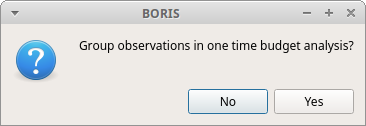

Choose **Yes** to group all observations into a single time budget analysis.

The **Analysis** \> **Time budget** menu option shows the time budget
for the events of the selected observations. Select the subjects and
behaviors you want to include in the time budget analysis:

All behaviors can be selected or deselected by clicking the Category name (in bold).

You can choose whether to include behavior modifiers in the time
budget analysis and to exclude behaviors without coded events.

The time budget analysis can be restricted to part of the observation:

-   Full observation(s): the analysis will be made on the full
    observation length.
-   Limit to time interval: use the **Start time** and **End time**
    boxes to select starting time and ending time.
-   Limit to observed events: the analysis will be made from the first
    observed event to the last observed event.

The last dialog window allows you to subtract the duration of one or
more behaviors from the total duration of the observation. This can be useful,
for example, if you have defined an "out-of-sight" code in your ethogram:

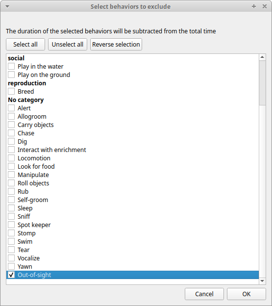

For each subject and behavior, the results include the **total number of
occurrences**, the **total duration** (for behaviors defined as
state events), the **mean duration** (for behaviors defined as state
events), the **standard deviation of duration**, the **mean inter-event
interval**, the **standard deviation of the inter-event
interval**, and the **percentage of the total observation
duration**. All durations are expressed in seconds (s).

<figure markdown>
  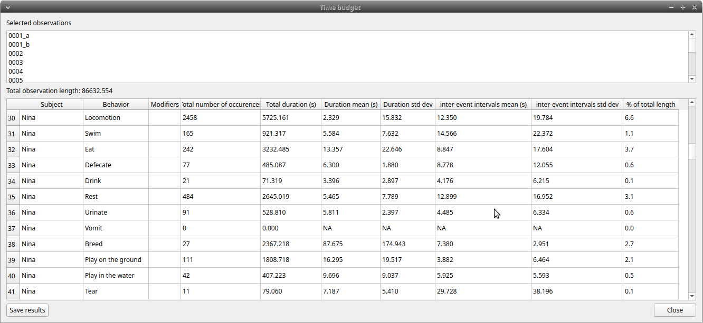
  <figcaption>Results of the time budget analysis</figcaption>
</figure>

The time budget results can be saved in various formats for further
analysis:

- Plain text in tabular format
    - **Tab Separated Values** (TSV)
    - **Comma Separated Values** (CSV)
    - **Hyper Text Markup language** (HTML)

- Spreadsheet files
    - **OpenDocument** (ODS)
    - **Microsoft Excel** (XLSX, XLS)
    
-  **Pandas dataframe** (to be loaded in Python with the [pickle
    module](https://docs.python.org/3/library/pickle.html))

-   **R dataframe** (to be loaded in R with [readRDS
    function](https://rdrr.io/r/base/readRDS.html))

!!! warning "Important"

    If a STATE behavior has an odd number of coded events, BORIS will report **UNPAIRED** instead of results.

## Time budget by behavioral category

The **Time budget by behavioral category** is similar to the [**Time budget analysis**](analysis.md#time-budget-analysis) 
except that the behaviors are grouped into **behavioral categories**.

<figure markdown>
  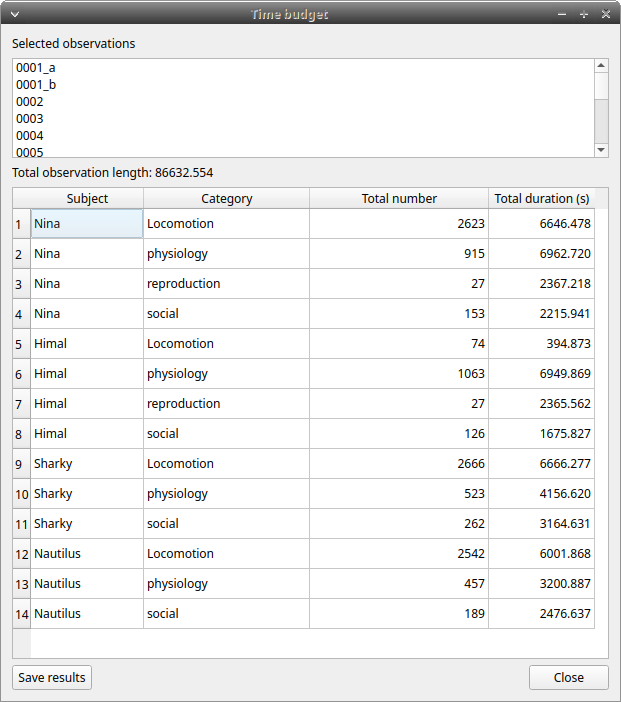
  <figcaption>Results of a time budget by behavioral category analysis</figcaption>
</figure>

## Synthetic time budget

The synthetic time budget is similar to the time budget analysis, but with fewer
parameters and a different organization of results. Results from all
selected observations are organized in columns on a single page. Two
parameters are currently provided: **number of occurrences** and **total
duration** (for behaviors defined as state events).

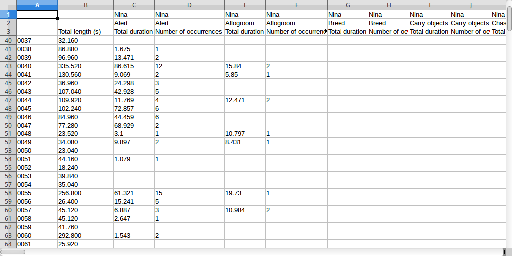

All duration times are expressed in seconds (s).

The time budget results can be saved in various formats for further analysis:

- Plain text in tabular format
    - **Tab Separated Values** (TSV)
    - **Comma Separated Values** (CSV)
    - **Hyper Text Markup language** (HTML)

- Spreadsheet files
    - **OpenDocument** (ODS)
    - **Microsoft Excel** (XLSX, XLS)

## Synthetic time budget with time bin

The **synthetic time budget with time bin** is similar to the **Synthetic time budget**, but the results are divided into time bins.

**Analysis** > **Synthetic time budget with time bin** 

Choose a time bin size (in seconds)

<figure markdown>
  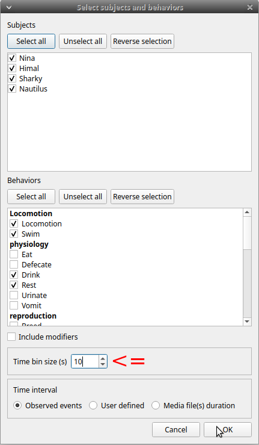
  <figcaption>Time bin size of 10 seconds</figcaption>
</figure>

<figure markdown>
  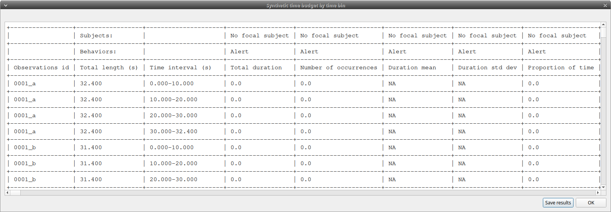
  <figcaption>Results of a Synthetic time budget with time bin of 10 seconds</figcaption>
</figure>

The **time budget with time bin** results can be saved in various formats for further analysis:

- Plain text in tabular format
    - **Tab Separated Values** (TSV)
    - **Comma Separated Values** (CSV)
    - **Hyper Text Markup language** (HTML)

- Spreadsheet files
    - **OpenDocument** (ODS)
    - **Microsoft Excel** (XLSX, XLS)

## Inter-rater reliability

The Cohen's kappa coefficient can be calculated (**Analysis** > **Inter-rater reliability** > **Cohen\'s kappa**).

[Cohen's kappa on Wikipedia](https://en.wikipedia.org/wiki/Cohen%27s_kappa)

After selecting 2 observations and a time window (in seconds) for the
analysis (the default value is 10 seconds), Cohen's kappa will be
displayed in the results window.

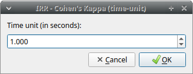

### Implementation of IRR Cohen's Kappa in BORIS

If a time window of n seconds is set, the 2 selected observations will be
checked every n seconds for agreement or disagreement, from the first event
to the last event of the 2 observations. In the case of a point event, the
presence of a corresponding event in the other observation will be
verified using a time window of n seconds centered on the point event.

An IRR Cohen's Kappa analysis is available in the GSEQ program
(<http://www2.gsu.edu/~psyrab/gseq>). For this the coded events can be
exported as aggregated events in SDIS format.
See [export aggregated events](export_events.md#export-aggregated-events).

## Similarities

Needleman-Wunsch similarity

## Co-occurrence

This function allows you to determine the co-occurrence of 2 behaviors.

## Advanced event filtering

This function allows filtering events from one or more observations by
selecting subjects, behaviors and logical operators.

To use the filter, select a subject, select a behavior and click on the
button with the green arrow on the side of the behaviors list. The tuple
subject/behavior will be added in the **filter text edit**. A complex
filter query can be constructed by adding parenthesis and logical
operator **&** (AND) or **|** (OR) for combining various subjects and behaviors.

Example of a summarized output showing the occurrences of Himal resting
while Nautilus in alert:

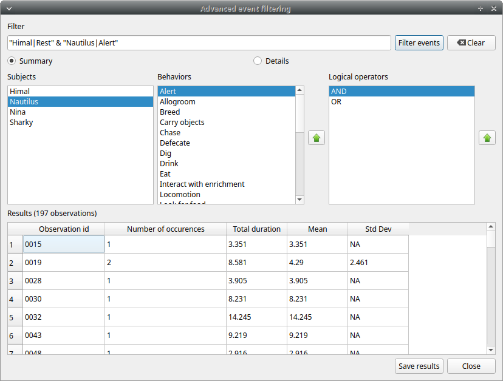

Example of a detailed output showing the overlapping intervals while
Himal rests and Nautilus is in alert:

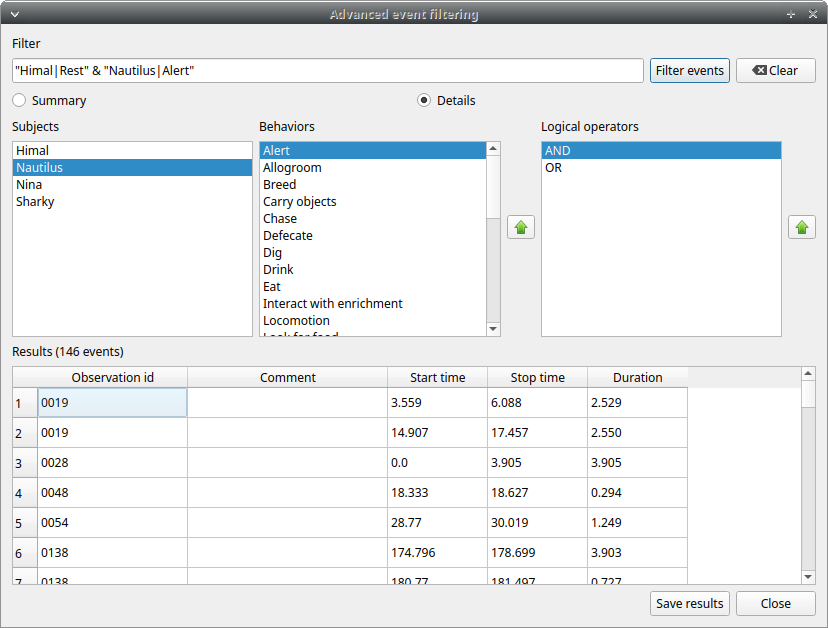

The same subject can be used multiple times in the query with OR or AND (in the case of non-exclusive behaviors):

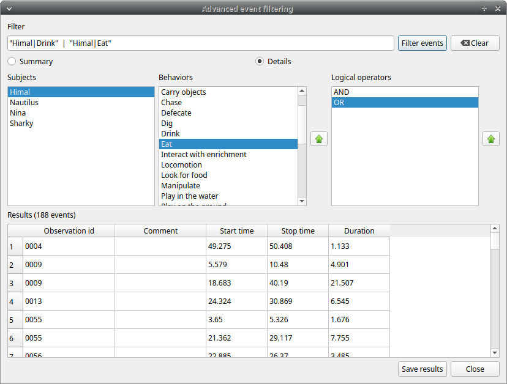

An unlimited number of conditions can be used:

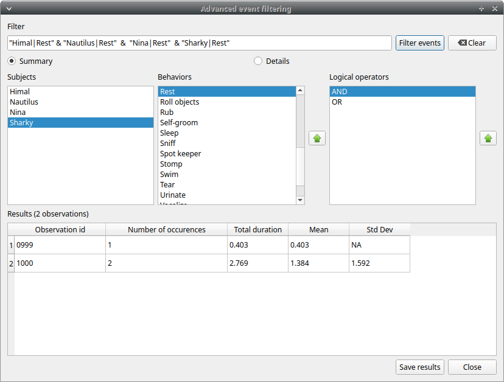

Parentheses can be used to group logical conditions into blocks:

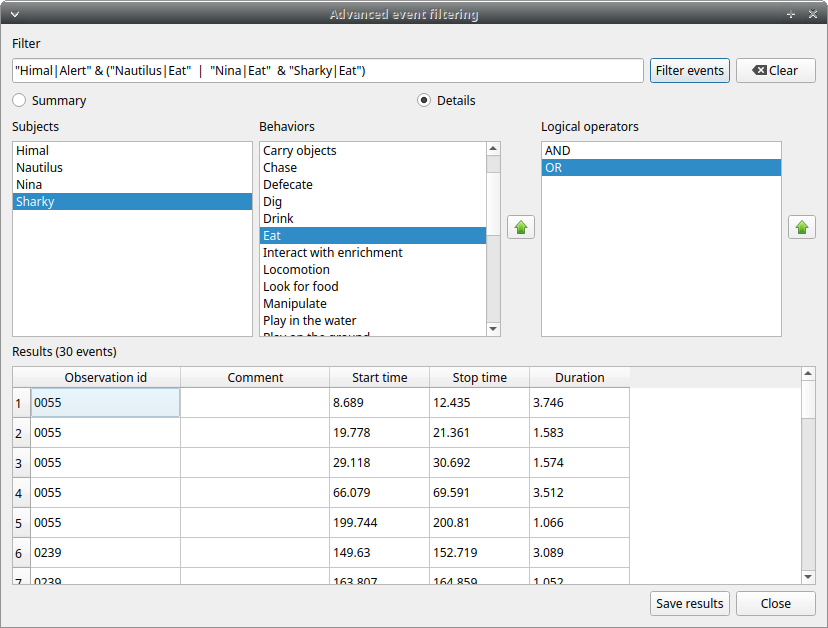

The results can be saved in a Tab Separated Values (TSV) file using the
**Save results** button. Other formats may be added in the future.

## Latency

The latency will analyze the time between one or more markers (arbitrary behaviors(s)) and other behaviors.

## Plugins

BORIS can load Python and R analysis plugins.
See [Analysis plugins](plugins.md) for plugin configuration, loading order, and plugin authoring details.
