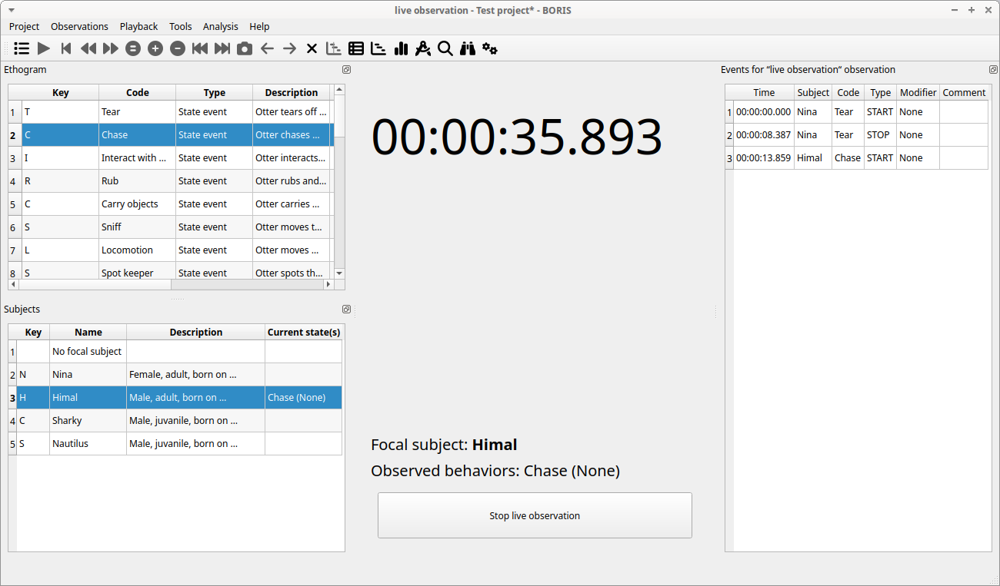
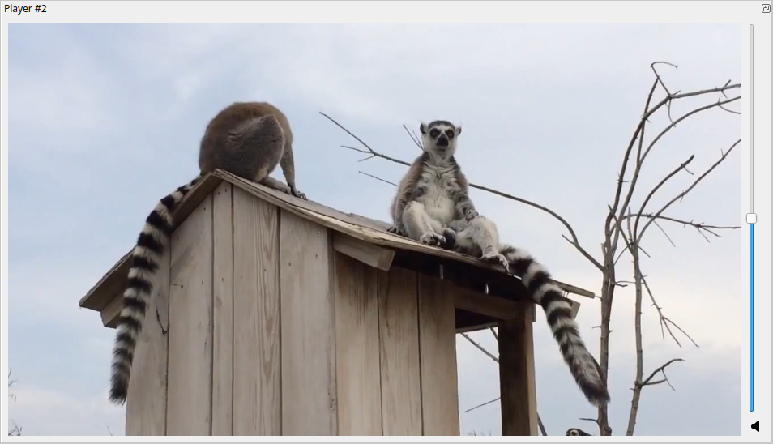
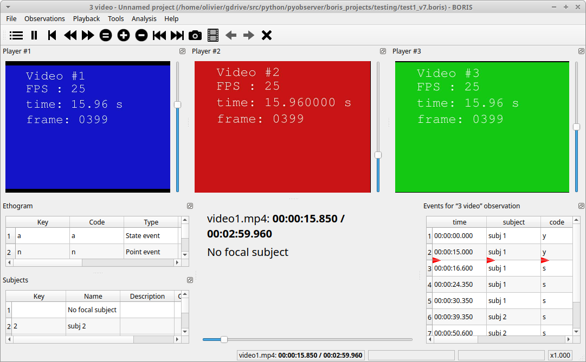
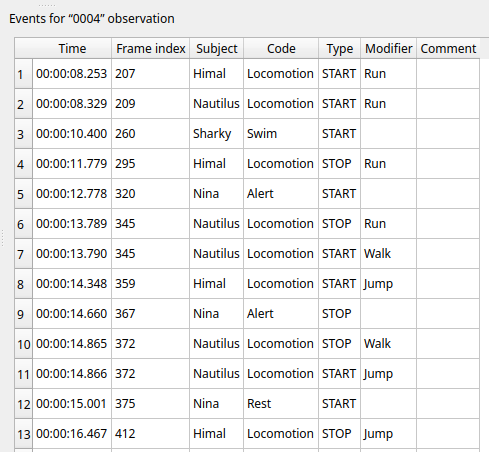
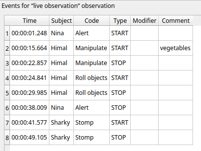
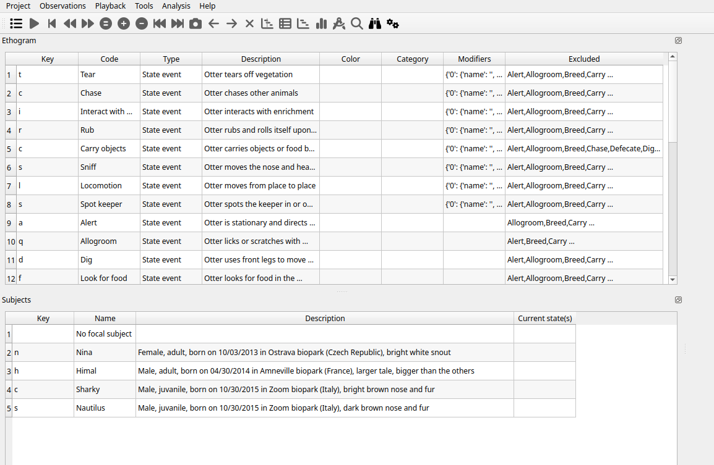
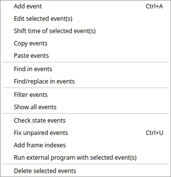
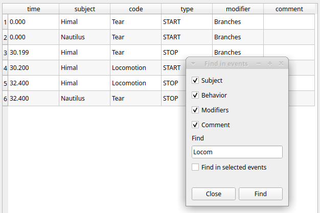
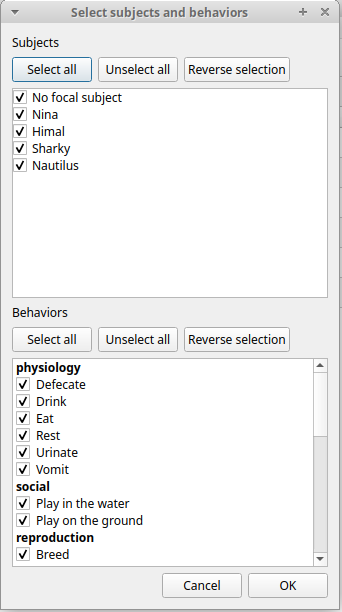
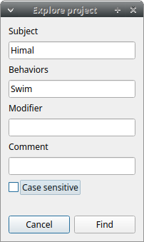

# Coding

When looking at the BORIS main window, the window title bar shows the
**Observation id** - **Project name** - **BORIS**. The media (the first
in the queue) will be loaded in the media player and paused.

## Media based coding

### The toolbar

<figure markdown>
  
  <figcaption>The BORIS toolbar</figcaption>
</figure>

:fontawesome-solid-list: **List of observations**

:fontawesome-solid-play:   **Play** (become :fontawesome-solid-pause: **Pause** when media is played)

:fontawesome-solid-backward-step:  **Rewind** reset your media at the beginning

:fontawesome-solid-backward:   **Fast backward** jumps for n seconds backward in your media (See [preferences](preferences.md)) 

:fontawesome-solid-forward:   **Fast forward** jumps for n seconds forward in your media (See [preferences](preferences.md)) 

<i class="fa-solid fa-circle-pause fa-rotate-90"></i>   **Set the playback speed to 1x**

:fontawesome-solid-circle-plus:   **Increase the playback speed** (See [preferences](preferences.md)) 

:fontawesome-solid-circle-minus:    **Decrease the playback speed** (See [preferences](preferences.md)) 

:fontawesome-solid-backward-fast:   **Jump to the previous media file**

:fontawesome-solid-forward-fast: **Jump to the next media file**

:fontawesome-solid-camera:   **Take a snapshot** of current video or frame

:fontawesome-solid-arrow-left:  **Move on frame back**

:fontawesome-solid-arrow-right:    **Move one frame forward**

:fontawesome-solid-xmark:   **Close current observation**

<i class="fa-solid  fa-2x"></i>   **Real time plot of events**

:fontawesome-solid-table-list:   **Time budget of the current observation**

:fontawesome-solid-chart-gantt:   **Plot events of the current observation**

:fontawesome-solid-chart-simple:   **Plot the time budget of the current observation**

:fontawesome-solid-compass-drafting:   **Geometric measurements**

:fontawesome-solid-magnifying-glass:    **Find in events**

:fontawesome-solid-binoculars:   **Explore project**

:fontawesome-solid-gears:   **Preferences**

The toolbar can be resized using the **Preferences** > **Interface** option.

The media can also be controlled by special keyboard keys:

++page-up++   Switch to the next media

++page-down++ switch to the previous media

++arrow-up++  Jump forward in the current media

++arrow-down++ Jump backward in the current media

++home++ Increase the playback speed (See [general preferences]() to set the step value)

++end++ Decrease the playback speed (See [general preferences]() to set the step value)

++backspace++  Set the playback speed to 1x

++arrow-left++ Go to the previous frame

++arrow-right++ Go to the next frame

## Live observations

During a live observation the media control toolbar is disabled.

Press the **Start live observation** button to start your observation.
If some events are already coded BORIS will ask you for deleting them.

A timer will be displayed. The events will be recorded in the events
widget.

<figure markdown>
  
  <figcaption>Live observation</figcaption>
</figure>

## **Ethogram** table in the main window

<figure markdown>
  
  <figcaption>Ethogram table in main window</figcaption>
</figure>

The **Ethogram** widget provide the user with the list of behaviors
defined in the **Ethogram**. It can be used to record an event by double
clicking on the corresponding row. The **Key** column indicates the
keyboard key assigned to each behavior (if any). Pressing a key will
record the corresponding behavior (that will appear in the *Events*
widget).

The behaviors shown in the ethogram widget can be filtered:

**Right-click** on ethogram widget \> **Filter behaviors**

Check/Uncheck single behaviors or double-click on the behavioral
category

<figure markdown>
  
  <figcaption>Filter behaviors in ethogram table</figcaption>
</figure>

## **Subjects** table in the main window

<figure markdown>
  
  <figcaption>The subjects table in main window</figcaption>
</figure>

The **Subjects** widget provide the user with the list of subjects
defined in the **Subject** tab in the **Project** window. It can be used
to add information about the focal subject on the recorded behaviors by
double clicking on the corresponding row. When a subject is selected
his/her name appears above the media player. The **Key** column
indicates the keyboard key assigned to each subject (if any).

The subjects shown in the subjects widget can be filtered:

**Right-click** on subjects widget \> **Filter subjects**

Check/Uncheck the subjects to show/hide them on the subjects' table.

<figure markdown>
  {width="80.0%"}
  <figcaption>Filter subjects in subjects table</figcaption>
</figure>

## The **media player** 

<figure markdown>
  {width="100.0%"}
  <figcaption>Media player</figcaption>
</figure>

<figure markdown>
  {width="100.0%"}
  <figcaption>3 media players playing 3 videos</figcaption>
</figure>

The media position can be set using the horizontal slide bar. Each media
player has its own audio volume control (the vertical slide bar on the
right side of the player).

The organization of the various widget can be customized:

<figure markdown>
  
  <figcaption>The widgets are undocked from the main window</figcaption>
</figure>

## The events table

The **events table** shows all the recorded behaviors (events).

The displayed parameters (organized in columns) depend of the type of the observation:

### Observation from media file

The following paramters are displayed:

-   **Time**, the time at which the event occurred;

-   **Frame index** the frame index corresponding to the event;

-   **Subject**, the focal subject (if any);

-   **Code**, the behavior code;

-   **Type**, in case of a **state event** indicates whether the time  corresponds to the start or to the stop. Empty for a **point event**;

-   **Modifier**, indicates the modifier(s) that was(ere) selected (if any);

-   **Comment**, is an open field where the user can add notes.

A tracking cursor (red triangle) will visualize the current event. This cursor can be positioned above the current event, see [tracking cursor position](preferences.md#tracking-cursor-above-current-event) option in **Preferences** window.

A double-click on a row will reposition the media player to the moment
of the corresponding event. See [Time offset for media reposition](preferences.md#time-offset-for-media-reposition-seconds) in **Preferences** window to customize the time offset for media repositioning.

### Live observation

The following paramters are displayed:

-   **Time**, the time at which the event occurred;

-   **Subject**, the focal subject (if any);

-   **Code**, the behavior code;

-   **Type**, in case of a **state event** indicates whether the time  corresponds to the start or to the stop. Empty for a **point event**;

-   **Modifier**, indicates the modifier(s) that was(ere) selected (if any);

-   **Comment**, is an open field where the user can add notes.

### Observation from pictures

The following paramters are displayed:

-   **Time**, the time at which the event occurred;

-   **Subject**, the focal subject (if any);

-   **Code**, the behavior code;

-   **Type**, in case of a **state event** indicates whether the time  corresponds to the start or to the stop. Empty for a **point event**;

-   **Modifier**, indicates the modifier(s) that was(ere) selected (if any);

-   **Comment**, is an open field where the user can add notes;

-   **Image index**, the image index (in the directory) corresponding to the event,

-   **Image path**, the path of the image corresponding to the event (can be relative or absolute).

To simplify the **events table** the relevant behaviors and subjects can be filtered see [Filter events](coding.md#filter-events)

## Events

### Recording an event

An event is a unique combination of a **time**, a **subject** and a **behavior**.
If the subject is not set it will be **No focal subject**.

Once ready to begin your coding, you can start the media player using
the **Play** :fontawesome-solid-play: button or the **Space bar**.

An **event** can be recorded by:

- pressing the predefined **key** of the keyboard corresponding to the behavior to record.

- double-clicking to the corresponding row in the **Ethogram** table.

- using the **Coding pad** (See [coding pad](tools.md#coding-pad)).

The **focal subject** can be selected by:

-  pressing the predefined **key** of the keyboard corresponding to the subject to select.

- double-clicking to the corresponding row in the **Subects** table.

- using the **Subject pad** (See [subject pad](tools.md#subject-pad)).

<figure markdown>
  {width="100.0%"}
  <figcaption>Ethogram and subjects widgets</figcaption>
</figure>

If the pressed key defines a single event, the corresponding event will
be recorded directly in the **Events** table. In the case you have specified the
same key for two (or more) events (e.g. key **d** in the figure below),
BORIS will prompt you for the desired behavior.

<figure markdown>
  
  <figcaption>Ask for a behavior</figcaption>
</figure>

In the case you have specified modifiers (one or more sets), BORIS will
prompt you for the desired modifier(s) if any (e.g. **ball** or
**opponent** in the figure below). You can select the modifiers using
the mouse or the keyboard (++1++, ++2++, ++3++, ++4++, ++5++ or ++6++ key)

<figure markdown>
  
  <figcaption>Ask for modifiers</figcaption>
</figure>

If no keys are defined for the modifier selection, you can type the
first character of the modifier and use the **Up arrow** and **Down
arrow** keyboard keys to select the correct modifier.

In the case your behavior type is a **Point event with coding map** or a
**State event with coding map**, BORIS will show the **Coding map**
window and will allow selecting the desired area(s). In case you click a
part of the map in which two (or more) areas overlap, the corresponding
codes will be recorded.

A recorded event can be edited (once selected) using the
**Observations** \> **Edit event** menu option. The resulting *Edit
event parameters* allows modifying every parameter (e.g. time, subject,
code, modifiers, and comment).

The **Observations** \> **Add event** menu option allows adding a new
event by specifying its time and the other parameters.

### The Events table context menu

Some functions are available in the Events table context menu.
Righ-click on the Events table and the menu will pop-up.

The various functions available in the menu are described below.
The same functions and others are available in the **Observations** menu.

### Undo an even recording

A wrong event can be removed from the events list using the **Undo** function (++ctrl+z++). You can go back till 25 events recorded events. 

### Add event

This option allows adding a new event by specifying its time and the other parameters.

<figure markdown>
  
  <figcaption>Add a new event</figcaption>
</figure>

Select a time format and imput the time value.

Select the **subject** from the drop-down menu or leave empty for **No focal subject**.

Select the **behavior** from the drop-down menu.

### Edit selected event(s)

This option allows to edit the selected event(s). When many events are
selected you have to choose the field to edit between **Subject**,
**Behavior** and **Comment**. In this case the new value will apply to
all selected events.

### Edit time of selected event(s)

This option allows to add or subtract a time value (in seconds) to all
selected events. For subtracting a value use a negative value.

### Copy events

This option allows to copy the selected events in the clipboard. The
clipboard will contain the values of the selected events (except the
**type** field) separated by a **<TAB\>** character.
The copied values are: **Time**, **Subject**, **Behavior**, **Modifier(s)**, **Frame index**

Example of clipboard content:

    8.253	Himal	Locomotion	Run		207
    8.329	Nautilus	Locomotion	Run		209
    10.400	Sharky	Swim			260
    11.778	Himal	Locomotion	Run		295
    12.778	Nina	Alert			320
    13.788	Nautilus	Locomotion	Run		345
    13.789	Nautilus	Locomotion	Walk		345
    14.348	Himal	Locomotion	Jump		359
    14.660	Nina	Alert			367
    14.865	Nautilus	Locomotion	Walk		372
    14.865	Nautilus	Locomotion	Jump		372
    15.000	Nina	Rest			375
    16.466	Himal	Locomotion	Jump		412
    16.467	Himal	Alert			412
    23.600	Nautilus	Locomotion	Jump		590
    23.600	Nautilus	Rest			590
    24.228	Nautilus	Rest			606
    24.407	Himal	Alert			611
    24.917	Himal	Locomotion	Walk		623
    39.682	Nautilus	Locomotion	Run		992
    40.549	Nina	Rest			1014
    42.313	Nautilus	Locomotion	Run		1058
    42.314	Nautilus	Rest			1058
    44.759	Himal	Locomotion	Walk		1119
    44.761	Himal	Allogroom			1119
    48.219	Nautilus	Rest			1206
    48.363	Himal	Allogroom			1209
    48.365	Himal	Locomotion	Walk		1209
    49.274	Himal	Locomotion	Walk		1232
    49.274	Himal	Drink			1232
    50.408	Himal	Drink			1261
    50.408	Himal	Swim			1261
    58.851	Sharky	Swim			1472
    58.950	Himal	Swim			1474

### Paste events

This option allows to paste the clipboard content into the events table. The clipboard must respect the format described in the previous section: 5 columns separated by a **<TAB\>** character.

### Find in events

This option allows to search for a string in the various field of
events. Select the fields to be searched. The find/replace operation can
be restricted to the selected events.

{width="60.0%"}

### Find/Replace in events

This option allows to search for a string and replace it by a new value
in the various field of events. Select the fields to be searched. The
find operation can be restricted to the selected events.

{width="60.0%"}

### Filter events

This option allows to filter the events by field value (Subject and Behavior).

### Show all events

This option reverts the previous one and allows to visualize all coded events.

### Check state events

This option allows to check if the **state events** are **PAIRED**, if
they have a **START** and a **STOP** occurences.

### Delete selected events

This option allows to delete the selected events. This operation is irreversible!

### Delete all events

This option is not present in the context menu but only in the main menu (**Observations** \> **Delete all events**).

This option allows to delete all then events in the current observation.
This operation is irreversible!

### Fix unpaired state

You can use the **Fix unpaired events** function to fix the **state events** without a STOP event.

**Observations** > **Fix unpaired events** (keyboard shortcut: ++ctrl+u++)

The program will ask for a time at which insert the STOP events for all unpaired **state events**

This function can be run on a set of selected observations (when no
observation is open). In this case the STOP events will be inserted at
the end of observation.

### Add frame indexes

This function can be used for the observations from a video.
The frame index corresponding to the coded events will be added in the events table.

### Run external program with selected events

This function is not yet implemented.

### Explore project

You can search information in various fields in all observations in the
current project (Observations \> Explore project).

The searchable fields are: **subject**, **behavior**, **modifier** and **comment**.

If more than one field is searched a logic **AND** will apply.

The events that were found are listed in a table. By double-clicking on
the row the corresponding observation will be opened and the
visualization will be scrolled to the row corresponding to the event.

### Frame-by-frame mode

You can switch between the media player and the frame-by-frame mode using the **arrow buttons** in the toolbar:

In frame-by-frame mode the video will stop playing and the user will
visualize the video frame by frame.

!!! note 
    Some video files should be re-encoded to be used in frame-by-frame mode. Otherwise the extracted frames are not reliable or it will not be possible to move backward.

You can move between frames by using the arrow keys in the toolbar (on
the right) or by using keyboard special keys:

++arrow-left++ Go to the **previous frame**

++arrow-right++ Go to the **next frame**

++page-up++   Switch to the **next media**

++page-up++  Switch to the **previous media**

++arrow-up++ **Jump forward** in the current media

++arrow-down++ **Jump backward** in the current media

If you have a numeric keypad you can use the following keys in alternative:

-   The key **/** will allow you to view the previous frame
-   The key *\** will allow you to view the next frame

To return in the media player mode press the **Play** :fontawesome-solid-play: button in the
toolbar.

