# Create a project

The BORIS project file serves as a container for all project-related information, excluding media files.
It includes the **ethogram**, **independent variables**, **subject definitions**, **behavioral coding maps**, **converters**, and **observation** data.
To save the project to your local file system, use **File** > **Save Project** or **Save Project As...**.

Additionally, you can enable the automatic backup feature in the [Preferences](./preferences.md) section.

!!! warning "Very important"

    It is **EXTREMELY IMPORTANT** to perform regular backups of your project files to prevent the loss of data. While software can be reinstalled, your data might be irretrievably lost.
    Consider using an external drive and/or a cloud service for secure backup.

BORIS lets you create an unlimited number of projects, but only one project can be open at a time.

A video tutorial about creating a project is available at [this link](https://www.youtube.com/watch?v=I97Dny5hFOE).

To create a new project, select **File** > **New project**.

Enter the project name in the **Project name** field in the **Information** tab.
Once the project has been saved, **Project file path** will show the full path to the project file.

**Date** is automatically set to the current date and time, but you
can change it to match your media date and time, or any other value
you prefer.

**Description** can contain any relevant information about your project, or it can be left empty.

**Time format** can be set to either **seconds** or **hh:mm:ss.mss**.
This setting can be changed at any time under **File** > **Preferences** or by using the **Preferences** button in the toolbar.

<figure markdown>
  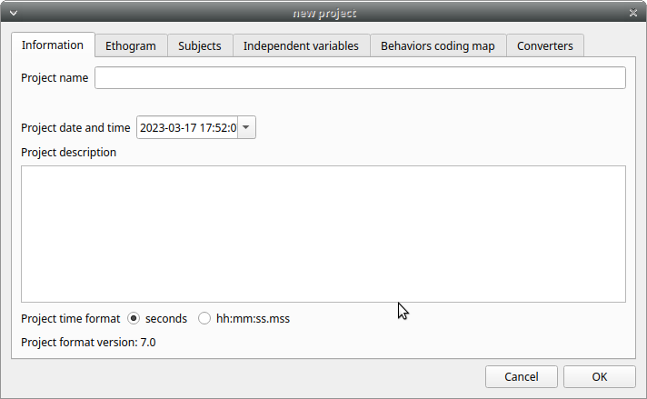
  <figcaption>BORIS main window</figcaption>
</figure>

## Set an ethogram

See the [Wikipedia ethogram definition](https://en.wikipedia.org/wiki/Ethogram).

In the **Ethogram** tab, you can:

- Create an ethogram from scratch;
- Import an existing ethogram from another BORIS project;
- Import an ethogram from a JWatcher global definition file (`.gdf`);
- Import an ethogram from a plain text file or a spreadsheet file (`.xlsx` or `.ods`).

<figure markdown>
  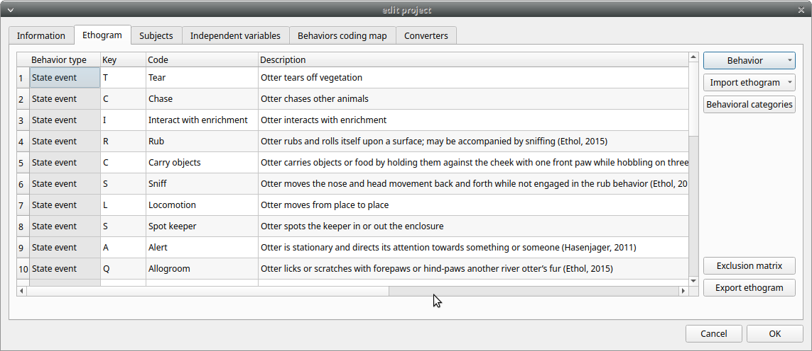
</figure>

<figure markdown>
  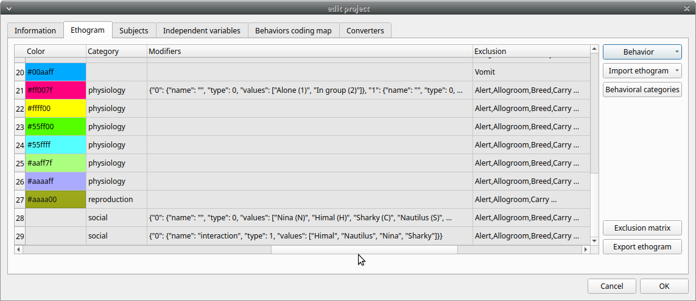
</figure>

### Set your ethogram from scratch

#### Add a behavior

Click **Behavior > Add behavior** to add a new row to the **Ethogram** table.
The behavior type is automatically set to **Point event**.

Cells with a gray background cannot be edited directly.
You must double-click on them and then select a value.

The order of behaviors in the table can be changed by right-clicking on the row of the behavior you want to move up or down.

#### Set the type of behavior

You can define **two types** of behavior. Double-click the cell and select the behavior type:

<figure markdown>
  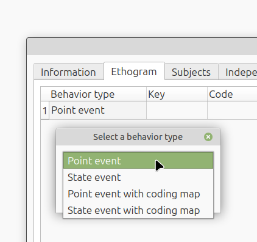
</figure>

- **Point event** behavior when the behavior has **no duration**.

  : The behavior is coded by pressing the assigned keyboard key
  (see below) or by double-clicking the corresponding row in
  the Ethogram table.

- **State event** behavior when the behavior has a **duration**.

  : The start and stop of the behavior are coded by pressing the
  assigned keyboard key (see below) or by double-clicking the
  corresponding row in the Ethogram table. These behaviors
  **must** have both a start event and a stop event; otherwise,
  an **UNPAIRED events** warning will appear when you close
  the observation or run an analysis.

- **Point event with a coding map**

  : A **Point event** that can be coded using a **coding map**.

- **State event with a coding map**

  : A **State event** that can be coded using a **coding map**.

You can switch between behavior types at any time by double-clicking the **Behavior type** cell.
You can also add a **Coding map** to either a **State event** (**State event with coding map**) or a **Point event** (**Point event with coding map**).
See the **Coding map** section for details.

An existing behavior can be duplicated using the **Clone behavior**
button. Its code must then be changed. To remove a selected behavior,
click **Remove behavior**. The **Remove all behaviors** button clears
the **Ethogram** table. Both operations require confirmation.

Behaviors can be sorted by clicking the Ethogram table headers.
They cannot be sorted manually.

#### Set a key for the behavior (optional)

For each behavior, you can assign a keyboard key in the **Key** column; this key will be used to code the corresponding events.
You can choose whether to set a unique key for each behavior or use the same key for more than one behavior.
If you assign the same key to more than one behavior, BORIS will pause coding and ask which behavior you want to record.
The keys are **case-sensitive**.

!!! note

    If your project was created with an older version of BORIS (< v.7),
    you can use **Convert keys to lower case** to convert all keys to
    lowercase. Otherwise, you will need to code the observation using uppercase
    keys.

    If you open a project file created with a version earlier than v.7, BORIS will ask you to convert uppercase behavior and subject keys to lowercase.

!!! warning "Important"

    **Do not use the / and \* keys! They are reserved for the frame-by-frame mode.**

From **version 9.9** onward, you can assign key combinations to trigger a behavior,
including **Ctrl**, **Alt**, and **Meta** (also known as the "Windows key") combined with a single key.

<figure markdown>
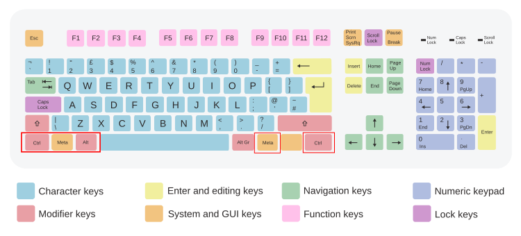{width="900px"}
<figcaption>ISO keyboard with 105 keys</figcaption>
</figure>

For the **Meta** key (orange in the keyboard diagram), see [https://en.wikipedia.org/wiki/Windows_key](https://en.wikipedia.org/wiki/Windows_key).

To set a key combination, double-click the **Key** cell. The following window will appear:

<figure markdown>
  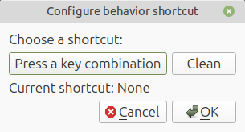{width=80%}
</figure>

Press the key combination you want to assign. A single modifier key, such as ++ctrl++, ++shift++, ++meta++, or ++alt++, is not a valid key combination.

  <figure style="margin: 0; width: 30%;">
    
  </figure>

  <figure style="margin: 0; width: 30%;">
    
  </figure>

  <figure style="margin: 0; width: 30%;">
    
  </figure>

  <figure style="margin: 0; width: 30%;">
    
  </figure>

  <figure style="margin: 0; width: 30%;">
    
  </figure>

  <figure style="margin: 0; width: 30%;">
    
  </figure>

You can also use the shortcut tool to select a single key.

Examples of combinations:

++ctrl+k++, ++meta+k++, ++alt+k++, ++ctrl+alt+k++, ++ctrl+meta+k++

++ctrl+1++

**Function keys** (pink in the keyboard diagram above) can also be assigned to a behavior,
from ++f1++ to ++f12++.

Examples of combinations including function keys:

++shift+f1++, ++ctrl+shift+f12++, ++meta+f3++

!!! note

    BORIS uses keyboard shortcuts for several functions, such as:

    - Saving a project (++ctrl+s++)
    - Creating a new observation (++ctrl+n++)
    - Starting an observation (++ctrl+o++)
    - Closing the current observation (++ctrl+q+)
    - Editing an observation (++ctrl+e++)
    - Opening the list of observations (++ctrl+l++)
    - Adding an event (++ctrl+a++)
    - Jumping forward in playback (++ctrl+f++)
    - Jumping backward (++ctrl+b++)
    - Jumping to a specific time (++ctrl+t++)
    - ...

    None of these shortcuts can be used to code behaviors.

!!! warning "Important"

    Consider that assigning a key combination to a behavior makes the project unusable in BORIS versions earlier than **9.9**.

!!! note

    On MacOS on the ethogram table:

    - The **control** key will be indicated as **Meta**

    - The **option** key will be indicated as **Alt**

    - The **command** key will be indicated as **Ctrl**

    <figure markdown>
    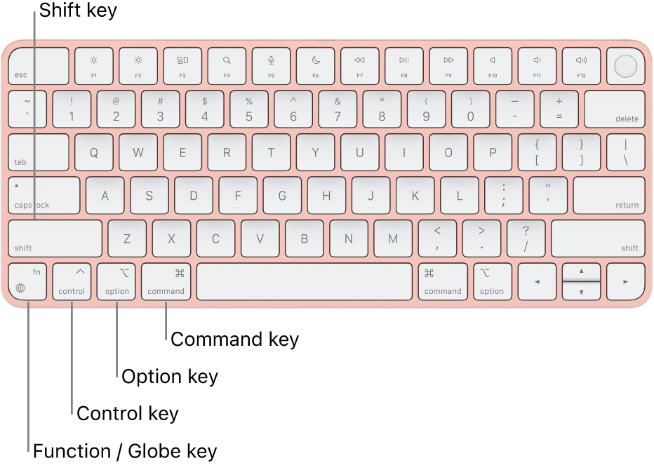{width="80.0%"}
    <figcaption>ISO keyboard with 105 keys</figcaption>
    </figure>

#### Set a code for the behavior (mandatory)

In the **Code** column, you must add a unique code for each behavior.
Duplicate codes are not accepted, and BORIS will display a red warning about duplicates at the bottom left of the **Ethogram** tab.
The code can be an alphanumeric string (which must not include the pipe character **\|**).

#### Give a description for the behavior (optional)

The **Description** of your behavior is optional. The **Description**
column can be useful for adding information about a specific behavior, its
characteristics (e.g., to standardize observations between different
users), or to refer to external information (e.g., a reference to a previous
ethogram).

The columns with a grey background (**Behavior type**, **Color**, **Category**, **Modifiers**, **Exclusion**,
**Modifiers coding map**) cannot be edited directly.

#### Select a color for the behavior (optional)

The **Color** column allows you to select a color for the behavior. This color will be used for plotting events.
Double-click on the cell and select the color you want to associate with the behavior.

<figure markdown>
  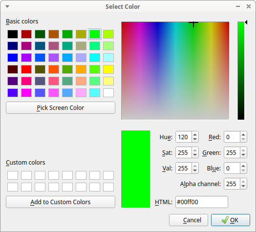
  <figcaption>Select the color to associate to the behavior</figcaption>
</figure>

#### Categories of behaviors

Defining categories of behaviors can be useful for the analysis of
coded events (for example, the [time budget analysis](analysis.md#time-budget-by-behavioral-category)).

The **Category** column allows you to assign the behavior to a predefined behavioral category.

Double-click on the cell and select the behavioral category for the behavior.

<figure markdown>
  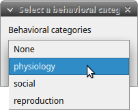
  <figcaption>Choose a behavioral category for the behavior</figcaption>
</figure>

To add, remove, or rename a behavioral category, click the **Behavioral categories** button.
A color can also be assigned to a behavioral category.

<figure markdown>
  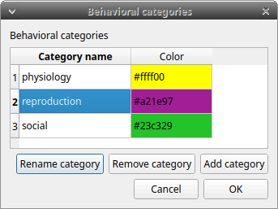
  <figcaption>Behavioral categories manager</figcaption>
</figure>

#### Set the modifiers

Modifiers can be used to add attributes to a behavior. A single behavior
can have two or more modifiers attached (e.g., the behavior **play** may have
**solitary** or **social** as modifiers). Using modifiers can
significantly reduce the number of keys and simplify
behavioral coding.

**Four types of modifiers** are available: **Single selection**, **Multiple
selection**, **Numeric**, and **Value from external data file**:

- The **Single selection** type allows the observer to select only
  **one** modifier for the current behavior.
- The **Multiple selection** type allows the observer to select
  one or more modifiers for the current behavior.
- The **Numeric** type allows the observer to input a number, for
  example, an interaction distance.
- The **Value from external data file** type saves the value of a
  variable from an external data file.

In BORIS, modifiers can also be organized into different modifier sets (e.g.,
**play** **social** may have a modifier set (#1) for **brothers** and
another (#2) for **sisters**). When using sets of modifiers,
you can select one or more modifiers for each set.

To add modifiers to a behavior, double-click the
**Modifiers** cell corresponding to the behavior you want to add modifiers to. The following window will appear:

<figure markdown>
  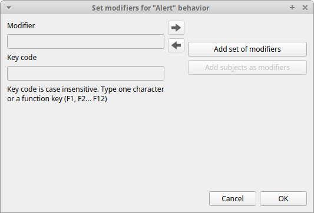{width="80.0%"}
  <figcaption>Modifiers configuration</figcaption>
</figure>

Click the **Add a set of modifiers** button:

<figure markdown>
  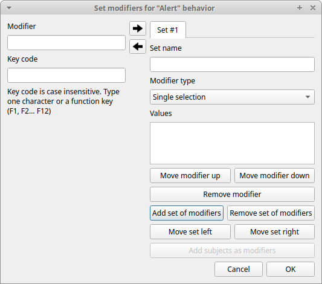{width="80.0%"}
  <figcaption>Modifiers configuration</figcaption>
</figure>

Select the modifier type using the **Modifier type** combo box. You must
choose between **Single selection**, **Multiple selection**,
**Numeric**, and **Value from external data file**.

##### **Single selection** and **Multiple selection** modifiers

Set a name for the new modifier set by typing it in the **Set name**
edit box. Setting a modifier set name is not mandatory.

Within a set of modifiers, you can add a modifier by typing the
modifier in the **Modifier** edit box. You can choose a shortcut (one
character, case-sensitive) for this modifier (optional). Then press the
**right-arrow** button to add the new modifier to the set.

<figure markdown>
  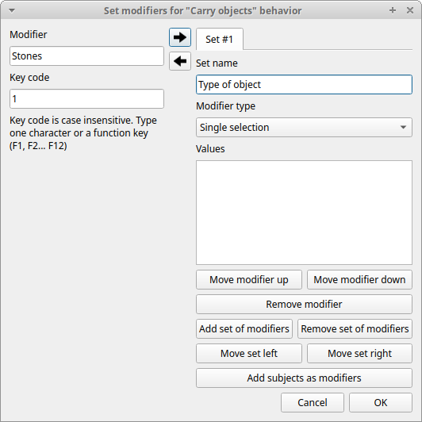{width="80.0%"}
  <figcaption>Modifiers configuration</figcaption>
</figure>

To modify a modifier, select it and press the **left-arrow** button,
edit the modifier, and press the **right-arrow** button.

A modifier can be removed by pressing the **Remove modifier** button.

After adding all modifiers, the window will appear like this:

<figure markdown>
  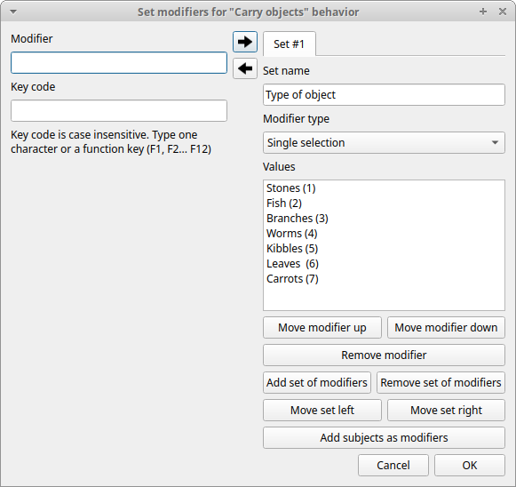{width="80.0%"}
  <figcaption>Modifiers configuration</figcaption>
</figure>

All defined subjects can be added as modifiers using the **Add subjects as modifiers** button.
This can be helpful, for example, when coding interactions between subjects.

The modifiers can be loaded from a plain text file. Use the **Load modifiers from file** button.

The modifier position within the modifier set can be manually set using
the **Move modifier up** and **Move modifier down** buttons.
The modifiers can be sorted alphabetically (use the **Sort modifiers** button).

You can add and/or remove sets using the **Add set of modifiers** and **Remove set of modifiers** buttons.

The position of a modifier set can be customized (using the **Move
set left** and **Move set right** buttons).

Modifiers cannot contain the following characters: **(** **\|** **)** **,** **\`** **~** **!**

Example of a **multiple selection** modifiers set:

<figure markdown>
  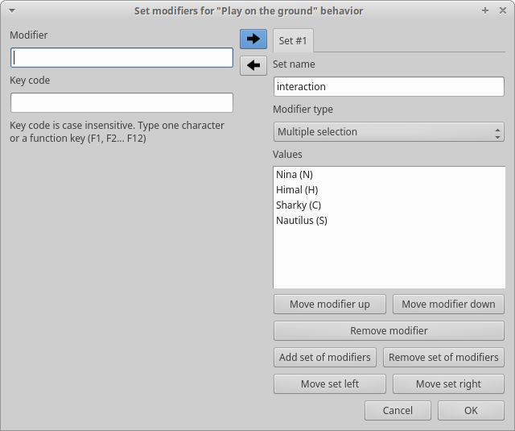{width="80.0%"}
  <figcaption>Modifiers configuration</figcaption>
</figure>

Multiple values can be selected together.

Example of 2 sets of modifiers:

<figure markdown>
  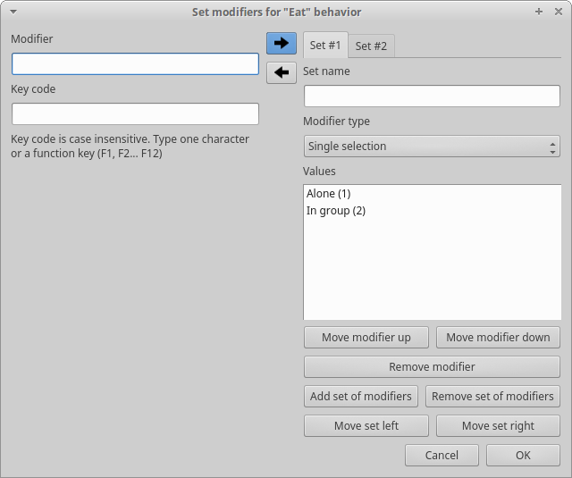{width="80.0%"}
  <figcaption>Modifiers configuration</figcaption>
</figure>

<figure markdown>
  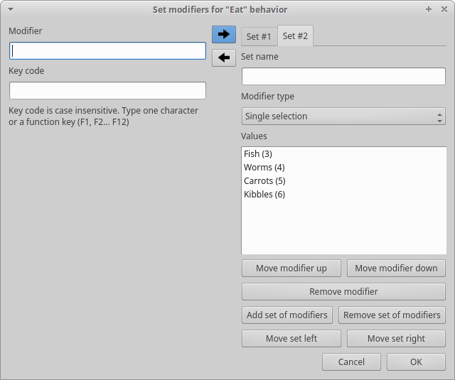{width="80.0%"}
  <figcaption>Modifiers configuration</figcaption>
</figure>

##### **Numeric** modifier

Set a name for the new set by typing it in the **Set name** edit box.
Setting a modifier set name is not mandatory.

When a **Numeric** modifier is triggered, BORIS will ask the observer
for a numeric value.

##### **Value from external data file** modifier

This modifier can be used to record the value of a variable from
an external data file (defined during the creation of the observation).

You must define the variable name in the **Variable name** edit box.
This is mandatory, and the variable name **must** match the
variable defined in the observation.

See [External data files](observations.md#external-data-files)

<figure markdown>
  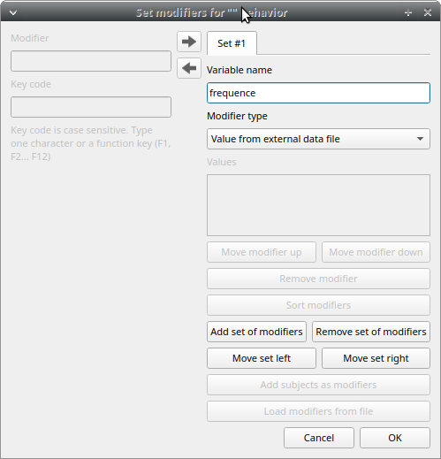{width="80.0%"}
  <figcaption>modifier value from external data file</figcaption>
</figure>

Click **OK** to save modifiers in the **Ethogram** table.

### Set the exclusion matrix

The occurrence of an event (State or Point) can exclude the occurrence
of a state event. This can be set using the **Exclusion matrix** window, which can be opened by clicking the **Exclusion
matrix** button. BORIS will ask whether to include **Point events** or not,
and a new **Exclusion matrix** window will open.

Exclusive behaviors may be selected by checking the corresponding
checkbox in the automatically-generated matrix. We suggest working on
the **Exclusion matrix** after all behaviors have been added to your
ethogram.

All behaviors can be excluded by a particular behavior by selecting the
corresponding entire row (click on the row header of the behavior) and
clicking the **Check selected** button. You can also uncheck all
behaviors by clicking the **Uncheck selected** button.

<figure markdown>
  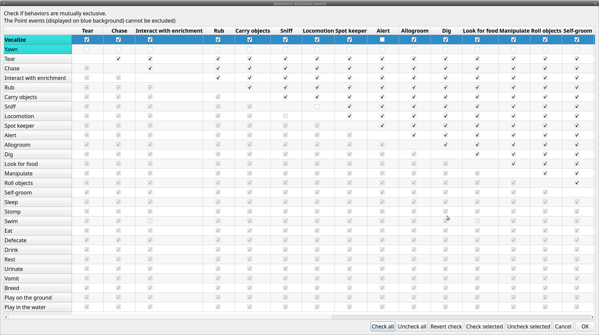{width="100.0%"}
  <figcaption>Example of an exclusion matrix</figcaption>
</figure>

For example in the previous figure, the **Alert** behavior will exclude
the following behaviors: **Allogroom**, **Breed**, **Carry objects**,
**Chase** \...

During the observation, the excluding event will stop all the current
excluded state events one millisecond before the occurrence of the event.

### Set the **Modifiers coding map**

If the behavior is defined as a **Point event with coding map** or a **State event with coding map**, you can associate a
**Modifiers coding map** to select the modifiers from a map.

### Import an ethogram from an existing project

Behaviors within an ethogram can be imported from an existing BORIS
project (.boris) using the **Import ethogram > from a BORIS project**
button. BORIS will ask you to select a BORIS project file and whether
imported behaviors should replace or be appended to the **Ethogram**
table. Imported behaviors will retain all previously defined
behavior parameters (namely Behavior type, Key, Code, Description,
Modifiers, and Exclusion information).

### Import an ethogram from a spreadsheet file

Behaviors can be imported from a spreadsheet file using the **Import
ethogram > from spreadsheet file (XLSX/ODS)** button.

The first row of your spreadsheet (header) must contain the following labels.
The order is not mandatory:

- Behavior code
- Behavior type
- Description
- Key
- Behavioral category
- Excluded behaviors

**Behavior code** is mandatory; the other fields can be empty.

Optional fields can be added:

- Color
- Modifiers (JSON)

BORIS will ask you to select a spreadsheet file (by default: *.xlsx or *.ods) and whether imported behaviors should replace or be appended to the **Ethogram** table. The missing information for the imported behaviors
must be redefined.

### Import an ethogram from a plain text file

Behaviors can be imported from a plain text file using the **Import
ethogram > from text file** button. The fields must be separated by
TAB, comma (,), or semicolon (;). All rows must contain the same number
of fields.

The first row of your plain text file must contain the following labels.
The order is not mandatory, but case must be respected:

- Behavior code
- Behavior type
- Description
- Key
- Behavioral category
- Excluded behaviors

**Behavior code** is mandatory; the other fields can be empty.

Example of a plain text ethogram definition:

    Behavior type,Behavior code,Key,Behavioral category,Description,Excluded behaviors
    state event,Play,p,,Play on the garden,s
    point event,Sleep,s,,Subject is sleeping,p

BORIS will ask you to select a plain text file (by default: \*.txt \*.csv
\*.tsv) and whether imported behaviors should replace or be appended to
the **Ethogram** table. The missing information for the behaviors
imported from the text file must be redefined.

### Import an ethogram from a JWatcher global definition file (.gdf)

Behaviors can be imported from a JWatcher global definition file (.gdf)
using the **Import ethogram > from JWatcher** button. BORIS will ask you to
select a JWatcher file (.gdf) and whether imported behaviors should
replace or be appended to the **Ethogram** table. Behavior type and
exclusion information for the behaviors imported from JWatcher must be
redefined.

### Access to the BORIS ethogram repository

This function can be activated by clicking the **Import ethogram \> from
the BORIS repository** button.

A list of available ethograms will open, and an ethogram can be loaded into
the current project.

<figure markdown>
  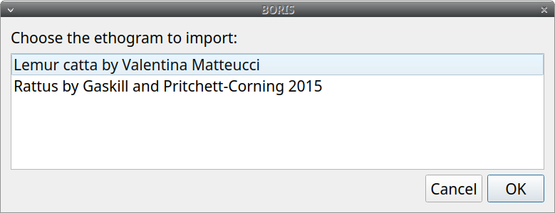{ width="50%"}
  <figcaption>BORIS ethogram repository</figcaption>
</figure>

### Export the ethogram

The entire ethogram can be exported in various formats (TSV, CSV, XLSX,
ODS, HTML). See **File** \> **Edit project** \> **Ethogram tab** \>
**Export ethogram**.

## Define the subjects

<figure markdown>
  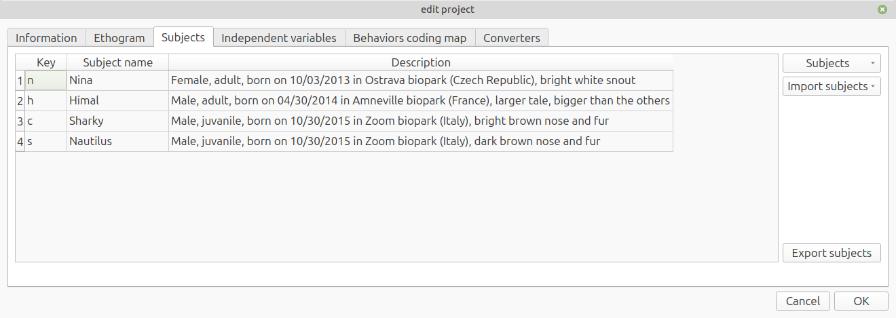{ width="80%"}
  <figcaption>configuration of subjects</figcaption>
</figure>

BORIS allows coding behaviors for different subjects within a single observation.
The **Subject** table allows you to select subjects using a keyboard **Key**,
**Subject name** (e.g., **Kanzi**), and **Description** (e.g., male, born on October 28, 1980).

### Set a key for the subject (optional)

With the subjects defined in the previous figure, pressing **n** will set **Nina** as the focal subject
for behavioral coding.
Pressing **n** again will deselect **Nina** and set the focal subject to **No focal subject**.

Defining a key is not mandatory. In this case, you will have to
select the current subject from the subjects list with a double-click.

The keys are **case-sensitive**, and the same key can be used to select more than one subject.
In this case, a dialog will appear allowing you to select.

<figure markdown>
  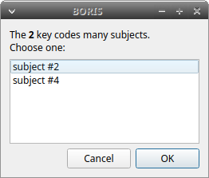
  <figcaption>Choose a subject</figcaption>
</figure>

Defining one or more subjects is not mandatory. Adding,
removing, and sorting subjects follows the same logic as the
**Ethogram** table (see [Set your ethogram from scratch](#set-your-ethogram-from-scratch) for details).

From **version 9.9** onward, it is possible to assign a combination of keyboard keys to select a subject,
allowing the use of **Ctrl**, **Alt**, and **Meta** (also known as "Windows key") combined with a single key.

Refer to [Set a key for the behavior](#set-a-key-for-the-behavior-optional) for details.

!!! warning "Important"

    Consider that assigning a key combination to a subject makes the project unusable in BORIS versions earlier than **9.9**.

!!! note

    If your project was created with a version of BORIS earlier than 7, you can use **Convert keys to lower case** to convert all keys to lowercase.
    Otherwise, you will need to code your observations using uppercase keys.

The subjects can also be imported from an existing BORIS project: use
the **Import Subjects from a BORIS project** button.

### Import subject from a spreadsheet

The subjects can be imported from a spreadsheet (Google Sheets,
Microsoft Excel, LibreOffice Calc).

The spreadsheet must contain one subject per row and be organized
as above:

- 1st column: Subject key (One character, case-sensitive, optional)
- 2nd column: Subject name (mandatory)
- 3rd column: Description of subject (optional)

Select all cells of your spreadsheet (++ctrl+a++), copy to clipboard (++ctrl+c++).
Click the **Import from clipboard** button.

!!! Note

    If you open a project file created with a version older than v.7 BORIS
    will ask you to convert the upper case behavior and subject keys to
    lower case.

## Define the Independent variables

<figure markdown>
  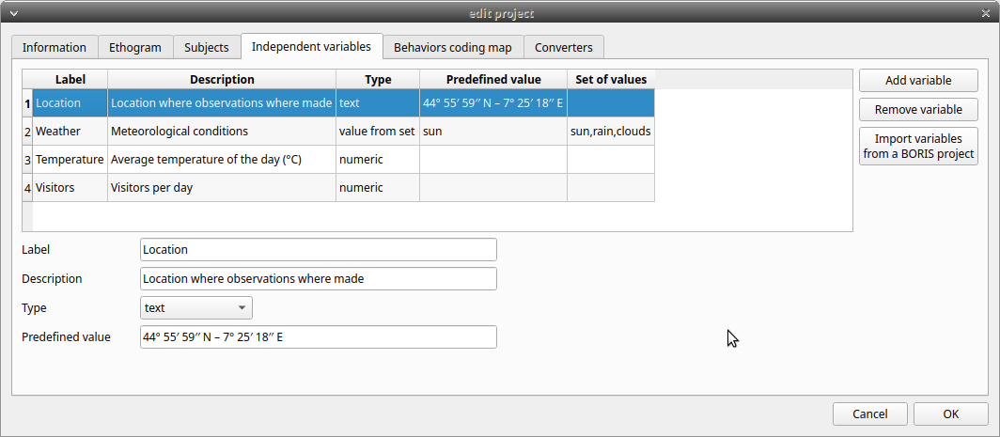{ width="80%"}
  <figcaption>Independent variables</figcaption>
</figure>

BORIS allows adding information about the observation using
**Independent variables**. This can be used to specify factors that may
influence behaviors (e.g., group composition, temperature, weather
conditions) but will not change during a single observation within a
project. Each independent variable can be defined by a **Label** (e.g.,
weather), a **Description** (e.g., weather conditions), a **Type**
(_text_, _numeric_, _value from set_, or _timestamp_).

The values of a set are defined in the **Set of values** column,
separating the available values with a comma (**,**). Please note that
the first value of the set will be selected by default. It is useful to define a NA value as the first value of every set.

The values for the independent variables will be requested when creating a
new observation. Adding, removing, and sorting independent
variables follows the same logic as the **Ethogram** table (see **Set
your ethogram from scratch** for details). Independent variables can
also be imported from an existing BORIS project using the **Import
Variables from a BORIS project**.

<figure markdown>
  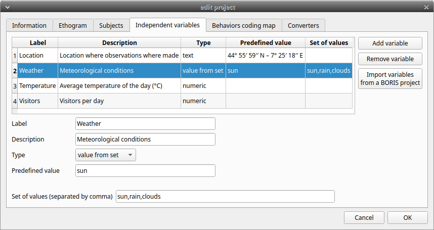{ width="80%"}
  <figcaption>Example of an independent variable (Weather) defined as "set of values"</figcaption>
</figure>

The predefined value must be contained in the set of values.

## Converters' table

Converters are used for plotting external data when the timestamp values
are not expressed in seconds. Converters can be written by the user,
loaded from a file, or loaded from the BORIS website repository
(<http://www.boris.unito.it/static/converters.json>).

<figure markdown>
  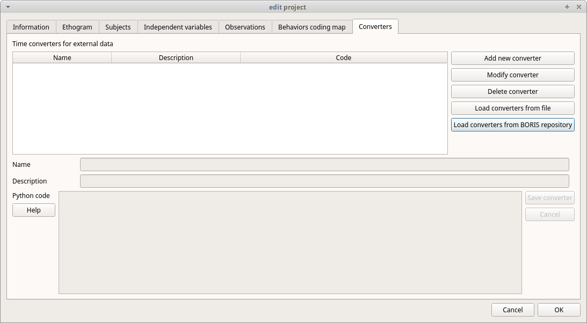{ width="80%"}
  <figcaption>Converters tab</figcaption>
</figure>

### Add new converter

Converters can be written using the Python 3 programming language.

The **INPUT** variable will be loaded with the original value from the
external data file (for example, 01:22:32).

The **OUTPUT** variable must contain the converted value in seconds (a
dot must be used as the decimal separator).

Example code to convert `HH:MM:SS` format to seconds:

    h, m, s = INPUT.split(':')
    OUTPUT = int(h) * 3600 + int(m) * 60 + int(s)

The Python function **strptime()** from the **datetime** module can be
useful for converting time values:
<https://docs.python.org/3/library/datetime.html#strftime-strptime-behavior>

Example code to convert a date in ISO 8601 format to seconds using the `strptime()` function:

    import datetime
    epoch = datetime.datetime.utcfromtimestamp(0)
    datetime_format = "%Y-%m-%dT%H:%M:%SZ"

    OUTPUT = (datetime.datetime.strptime(INPUT, datetime_format) - epoch).total_seconds()

**File** \> **Edit project** \> **Converters**

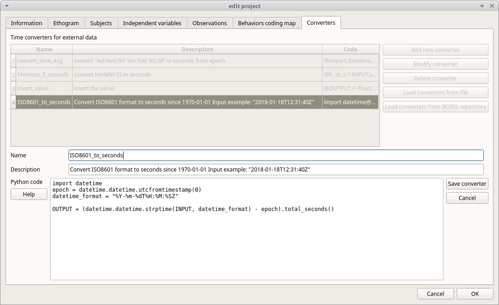{width="100.0%"}

### Load converters from BORIS web site

Click **Load converters from BORIS repository** and select the
converters to be added to your project.

<figure markdown>
  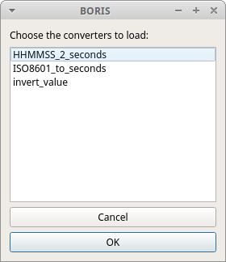{ width="80%"}
  <figcaption>Converters selection from repository</figcaption>
</figure>

<figure markdown>
  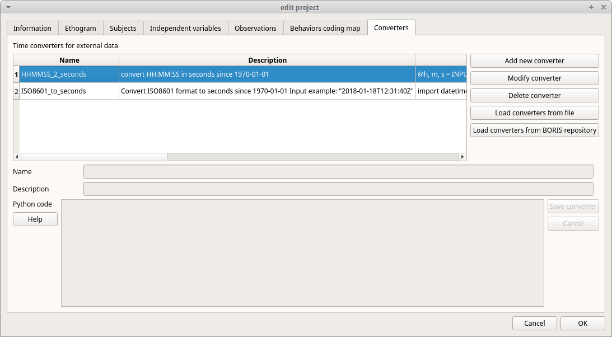{ width="80%"}
  <figcaption>Converters tab with 2 converters defined</figcaption>
</figure>

### Writing a converter

See [Converters for external data values](tools.md#converters-for-external-data-values).

The converters loaded in your project can then be selected for
converting timestamps (or other values) in external data files.

See [Converters](observations.md#converters)
