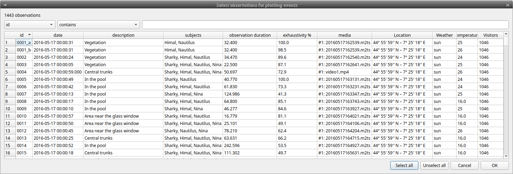
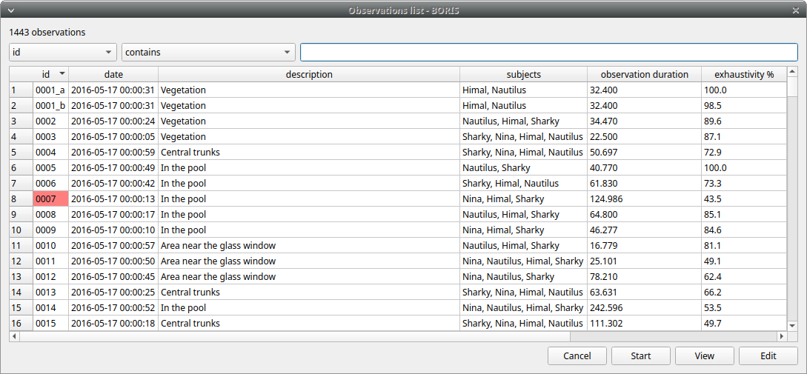
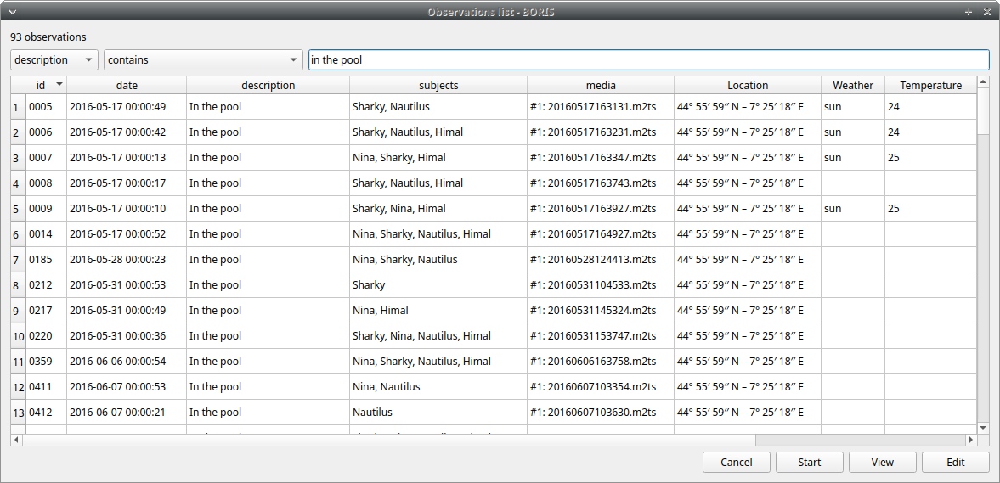
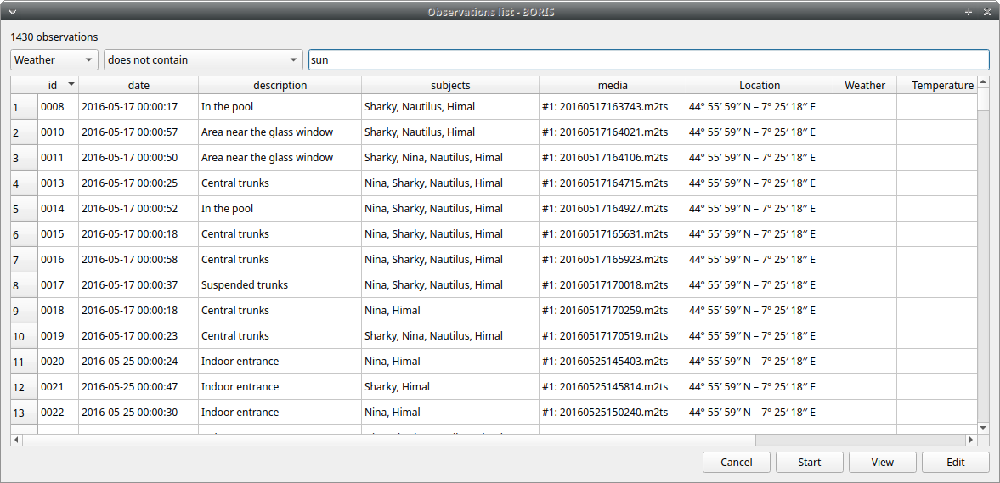
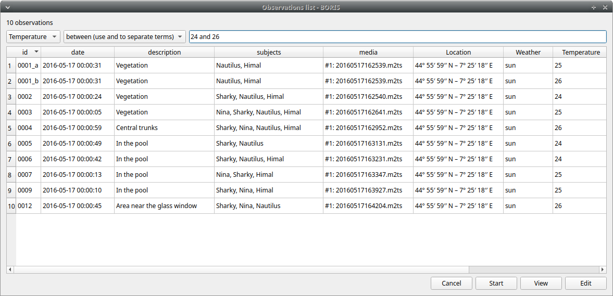
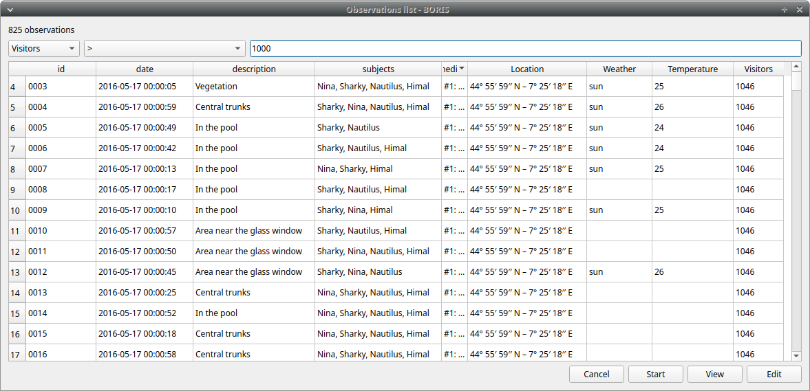
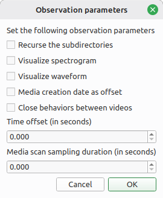

## Observations list

**Observations** > **Observations list** shows all the
observations contained in the current BORIS project.

The following values are displayed:

- the observation id (**id**)

- the **description** of the observation

- the coded subjects (**subjects**)

- the **observation duration** (as the difference between the last recorded event and the first one)

- the percent of **exhaustivity** of the coding (as the sum of the length of the coded events divided by the observation duration)

- the **media** file path, **LIVE** for a live observation, or the pictures directory path for an observation based on pictures

- the values of the independent variables (if defined)

The observations can be sorted by clicking the desired column header
(alphabetic order ascending or descending).

### Checking the observations

The observation status is displayed in the first column (**id**).
If the background of this column is **red**, the observation has one or more UNPAIRED state events.
These UNPAIRED observations will not be analyzed. See [Fix unpaired state events](coding.md#fix-unpaired-state) for details.

{width="100.0%"}

### Filtering the observations

The observations list can be filtered by selecting a field and a condition from the drop-down lists.

In the following example observations are filtered: only observations
with **description** containing the **In the pool** subject are shown:

<figure markdown>
  
  <figcaption>Observations list</figcaption>
</figure>

Observations can be filtered with **Independent variables** values.

The following example displays only the observations that do not contain
"Sunny" in the **Weather** independent variable :

<figure markdown>
  
  <figcaption>Observations list</figcaption>
</figure>

Observations with a value of **Temperature** independent variable between 18 and 22:

<figure markdown>
  
  <figcaption>Observations list</figcaption>
</figure>

Observations with a value of **Visitors** independent variable greater than 1000:

<figure markdown>
  
  <figcaption>Observations list</figcaption>
</figure>

## Delete observations from project

Observations can be deleted from the project using the following
procedure:

**Observations** > **Remove observations**

Select the observations you want to delete.

Click the **OK** button and confirm the deletion.

Deletion is irreversible, and deleted observations cannot be restored.

It's a good idea to back up your project before proceeding with removing observations.

## Create observations in bulk

Observations from media files can be created from a directory of media files:

**Observations** > **Create observations**

Choose the directory.

Select the parameters.

<figure markdown>
  
  <figcaption>Parameters for creating observations</figcaption>
</figure>

The ID of each created observation will be the path to the media file.

## Import observations

The **Observations** > **Import observations** option allows you to import observations.
Two formats are available for importing observations:

### From a BORIS project file

Choose the BORIS project file and then the observations to import. BORIS will check
whether observations with the same ID already exist in the current
project. BORIS will also check if behaviors and/or subjects used in the
imported observations are not defined in the current project.

### From a spreadsheet file

Observations can be imported from:

- OpenDocument (ODS)
- Microsoft-Excel (XLSX)

Choose the spreadsheet file

## Export a list of observations

This option allows you to export the selected observations as a list in various formats (CSV, TSV, ODS, XLSX, HTML):

**Observations** > **Export observations list**

The data frame will contain the following columns:

* Observation id
* Date
* Description
* Subjects
* Media files/Live observation
* independent variables
