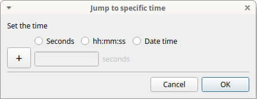
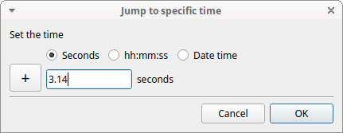
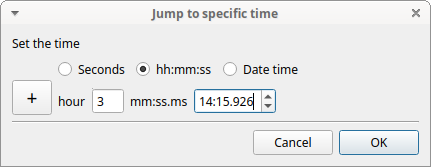
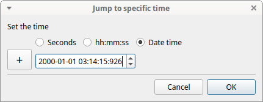
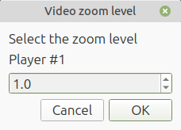
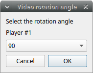
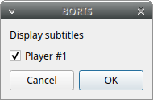
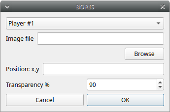
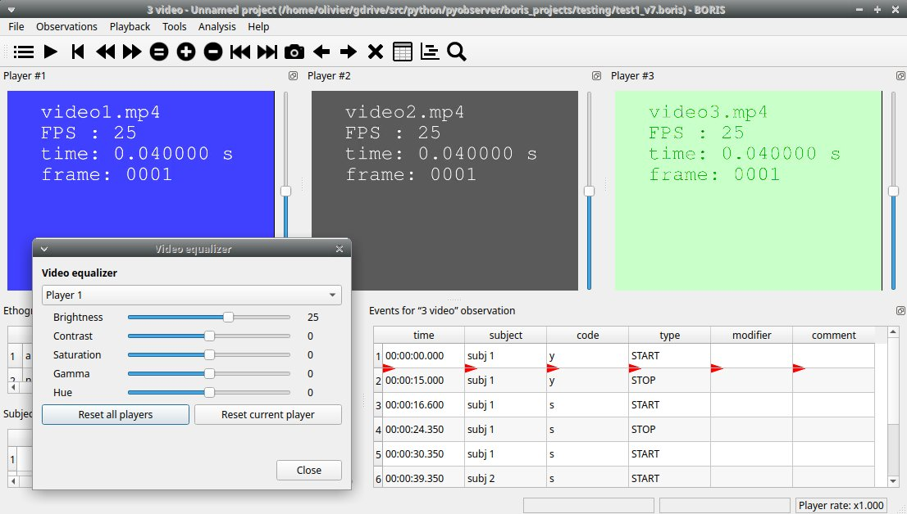

# Playback menu

## Jump

### Jump forward

:   Allows you to jump forward in the current media file. See **File** \> **Preferences** for setting the jump value.

### Jump backward

:   Allows you to jump backward in the current media file. See **File** \> **Preferences** for setting the jump value.

### Jump to specific time

:   Allows you to go to a specific time in the current media file.

The time selection widget will pop-up:

3 formats are available to select the time:

- Decimal seconds:

- HH:MM:SS:ZZZ format (ZZZ indicates the milliseconds):

- A date-time format (YYYY-MM-DD hh\:mm\:ss.zzz):

## Zoom level

The zoom level can also be set using the menu **Playback** > **Zoom level**

### Using the keyboard

Click the media player you want to set the zoom level.

**Zoom in**  ++ctrl+plus++

**Zoom out**  ++ctrl+minus++

**Reset zoom level** ++ctrl+0++

!!! warning "Important"

    On Microsoft Windows, only the ++plus++ and ++minus++ keys on the numeric keypad can be used.

### Using the mouse

Click the media player you want to set the zoom level.

**Zoom in**  ++ctrl++ + **Mouse Wheel Up**  or Double click on left mouse button

**Zoom out**  ++ctrl++ + **Mouse Wheel Down** or Double click on right mouse button

**Reset zoom level**  Click the **right mouse button** on the video.

!!! warning "Important"

    On Microsoft Windows, the mouse cannot be used to zoom the video

## Pan video

Click the media player you want to pan.

### Using the keyboard

**Pan Up** ++ctrl+arrow-down++ 

**Pan Down** ++ctrl+arrow-up++ 

**Pan Left** ++ctrl+arrow-left++ 

**Pan Right** ++ctrl+arrow-right++ 

### Using the mouse

**Pan Up**: **Mouse Wheel Up** (the video moves down)

**Pan Down**: **Mouse Wheel Down** (the video moves up)

**Pan Left**: ++shift++ + **Mouse Wheel Up** (the video moves to the right)

**Pan Right**: ++shift++ + **Mouse Wheel Down** (the video moves to the left)

**Reset Pan and zoom**: ++shift++ + **Left mouse button**

!!! warning "Important"

    On Microsoft Windows, the mouse cannot be used to pan the video

## Rotate video

Select the video rotation angle for each player using the menu **Playback** > **Rotate video**.
The available rotation angles are: 0, 90, 180 and 270.

## Display subtitles

Select to display or hide the subtitles using the menu **Playback** > **Display subtitles**. The subtitles file must have
exactly the same name of the video file except for the extension and be
placed in the same directory.

## Image overlay on video

Select an image overlay to be displayed on the video **Playback** > **Image overlay on video** > **Add**.
If the selected image does not have a transparent background the transparency can be set
from 0 (full transparency) to 255 (no transparency).

The image must be in PNG format, if the image is smaller than the video
resolution the image position can be set from the top-left corner (x:
horizontally, y: vertically).

Select **\> Playback \> Image overlay on video \> Remove** to remove the image overlay.

## Video equalizer

**Playback** > **Video equalizer**

Using this function the **brightness**, the **contrast**, the **saturation**, the **gamma** and the **Hue** can be set for each player.

