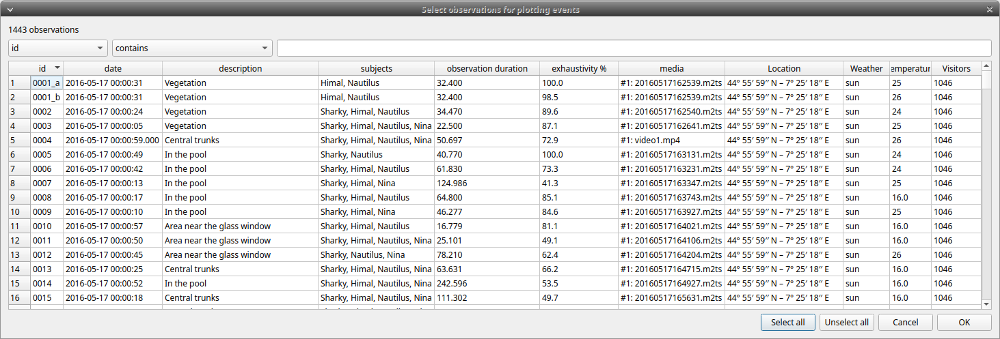
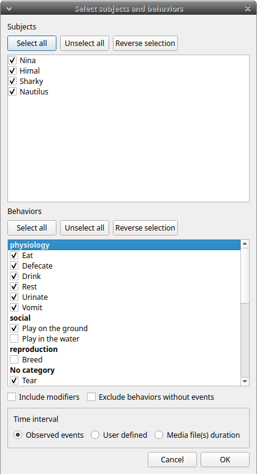
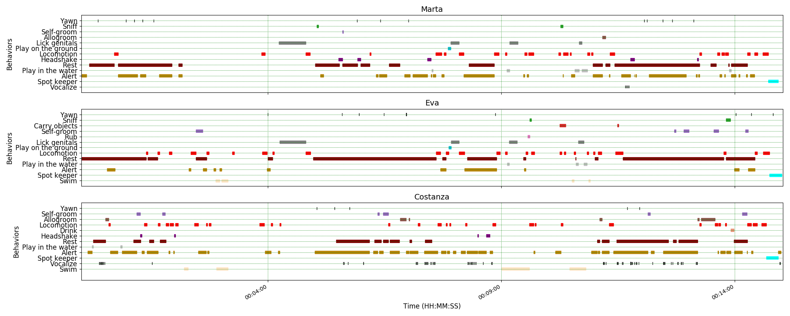
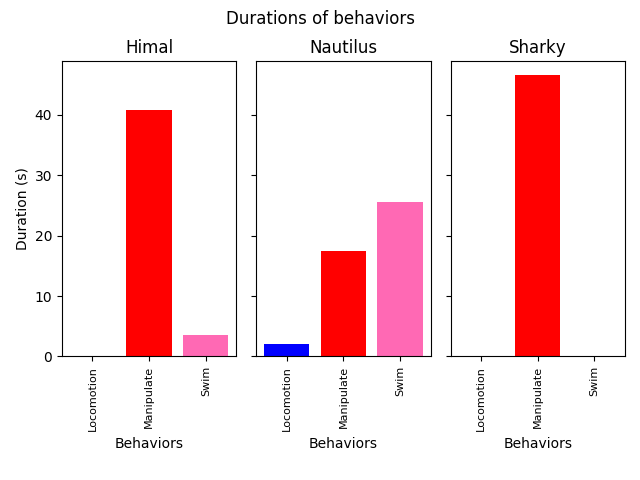
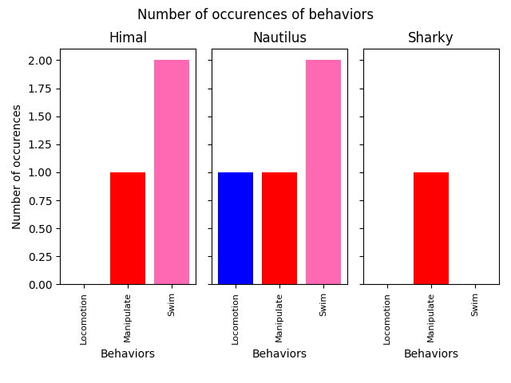

# Plot

## Plot events

Recorded events can be plotted along a time axis.

**Analysis** > **Plot** > **Plot events**

Select the **observations** you want to plot.
If more than one observation is selected, BORIS will ask you to choose a directory to save the plots.

<figure markdown>
  
  <figcaption>Select the observations to plot</figcaption>
</figure>

The **subjects** and **behaviors** to include in the plot can be selected in the following window:

You can choose whether to include behavior modifiers (if any) and to
exclude behaviors without coded events.

The time interval can be selected (see time budget).

The plot can be exported in various bitmap formats (PNG, JPG, TIFF)
or vector graphics formats (SVG, PDF, EPS, PS). The SVG format can be further
edited with the [Inkscape vector graphics editor](https://inkscape.org).

!!! warning "Important"

    If a STATE behavior has an odd number of coded events, you will see this error message:
    "The STATE behavior XXX is not paired"

This function creates one plot per subject on a single figure.

Behavior colors can be customized. See [Plot colors](preferences.md#plot-colors).

## Plot time budget

The duration and number of occurrences can be plotted for each subject
and behavior.

**Analysis** \> **Plot** \> **Plot time budget**

The subjects and behaviors to include in the plot can be selected in the following window:

{width="60.0%"}

Behavior modifiers cannot currently be included in the plot.

The time interval can be selected (see time budget).

The plot can be exported in various bitmap formats (PNG, JPG, TIFF)
or vector graphics formats (SVG, PDF, EPS, PS). The SVG format can be further
edited with the [Inkscape vector graphics editor](https://inkscape.org).

!!! warning "Important"

    If a STATE behavior has an odd number of coded events, you will see this error message:
    "The STATE behavior XXX is not paired"

This function creates two plots including all subjects for each observation:

-   A plot of the behavior durations for behaviors defined as STATE
    events.
-   A plot of the number of occurrences for all behaviors.

Behavior colors can be customized. See [Plot colors](preferences.md#plot-colors).

{width="70.0%"}

{width="70.0%"}

