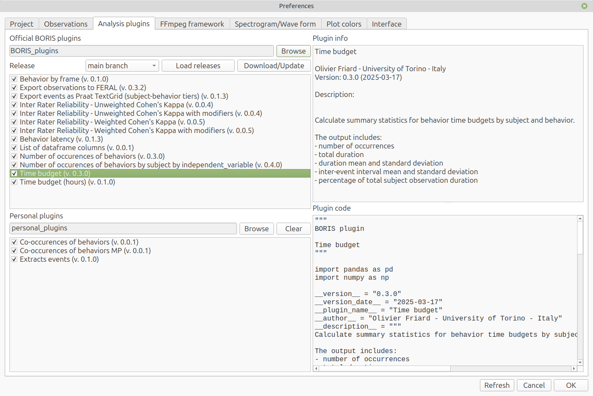
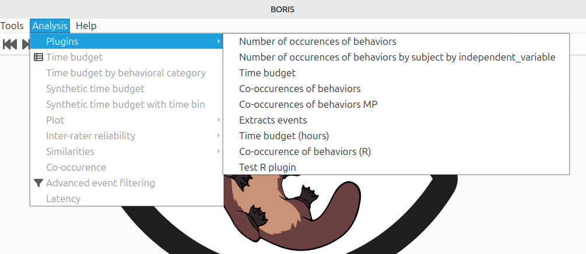
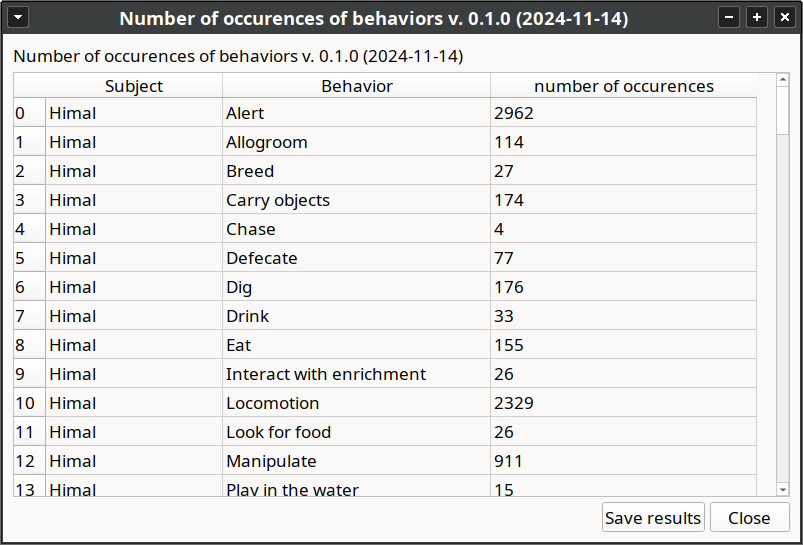

# Analysis plugins

Starting from version 9, BORIS can load analysis plugins to process coded events.
Plugins can be written in **Python** or **R**.

!!! warning "Important"

    The plugin interface is intended for custom analyses and may change between BORIS versions.


## Plugin sources

BORIS loads plugins from two sources.

**Official BORIS plugins**

:   Official plugins are loaded first. BORIS looks for an external BORIS plugins repository in this order:

    - the directory configured in **Preferences** > **Analysis plugins**;
    - the path set in the `BORIS_PLUGINS_DIR` environment variable;
    - a `BORIS_plugins` directory next to the BORIS source directory;
    - `~/BORIS_plugins`.

    If no external official plugin repository is found, BORIS falls back to the bundled plugins in the BORIS installation.

**Personal plugins**

:   Personal plugins are loaded from the directory selected in **Preferences** > **Analysis plugins**.
    BORIS loads Python files (`.py`) and R files (`.R`) found directly in that directory.
    Files whose name starts with `_` are ignored.

If an official plugin and a personal plugin use the same plugin name, the official plugin is kept and the duplicate personal plugin is not loaded.


## Managing plugins in Preferences

Open **File** > **Preferences** > **Analysis plugins**.


The **Official BORIS plugins** section contains:

- the directory currently used for the official plugin repository;
- a **Browse** button to select another official plugin repository directory;
- a **Download/Update** button to download or update the official BORIS plugins repository;
- a list of official plugins with check boxes.

The **Personal plugins** section contains:

- the directory currently used for personal plugins;
- a **Browse** button to select a personal plugins directory;
- a **Clear** button to remove the saved personal plugin path without deleting the directory or its files;
- a list of personal plugins with check boxes.

Plugin lists show the plugin version next to the plugin name when a version is available.
Click a plugin in the list to display its metadata and source code.



Changes are saved when you click **OK** in the Preferences window.


## Running a plugin

To run a plugin, select **Analysis** > **Plugins**, then choose the plugin.



BORIS lists official plugins first. Personal plugins are listed after a separator.

When a plugin is started, BORIS asks you to select:

- the observations to analyze;
- the subjects and behaviors to include;
- the time interval or observation interval to use.

The plugin result is displayed in a result window.



Plugin results can be saved from the result window in the available export formats.


## Data passed to plugins

For Python plugins, BORIS inspects the type annotations of the plugin `run` function and passes only the requested objects.

The following arguments are supported:

`df`

:   A Pandas DataFrame containing the selected and filtered events.
    The parameter must be annotated as `pd.DataFrame` or as a union that includes `pd.DataFrame`, for example `pd.DataFrame | None`.

`project`

:   A copy of the BORIS project dictionary containing only the selected observations.
    The parameter must be annotated as `dict` or as a union that includes `dict`, for example `dict | None`.

`parameters`

:   A dictionary with the analysis selections made by the user, including selected subjects, selected behaviors, and time filtering options.
    The parameter must be annotated as `dict` or as a union that includes `dict`, for example `dict | None`.

String annotations are also accepted. This means that plugins using `from __future__ import annotations` can use the same signatures.

Example:

```python
import pandas as pd


def run(
    df: pd.DataFrame | None = None,
    project: dict | None = None,
    parameters: dict | None = None,
) -> pd.DataFrame:
    if df is None:
        return pd.DataFrame()

    return df.groupby(["Subject", "Behavior"]).size().reset_index(name="count")
```

The DataFrame passed to the plugin includes columns such as:

```text
Observation id
Subject
Behavior
Behavioral category
Behavior modifiers
Behavior type
Start (s)
Stop (s)
Duration (s)
Comment start
Comment stop
```

The DataFrame also includes one column for each independent variable and one column for each behavior modifier set defined in the project.


## Python plugin structure

A Python plugin is a `.py` file that defines a `run` function and plugin metadata.

The plugin metadata are:

```python
__plugin_name__ = "PLUGIN NAME"
__version__ = "x.y.z"
__version_date__ = "YYYY-MM-DD"
__author__ = "AUTHOR - INSTITUTION"
__description__ = "Short plugin description"
```

The `run` function can return:

- a string;
- a Pandas DataFrame;
- a tuple of results.

Each result can optionally be returned as `(title, payload)`, where `payload` is a string or a Pandas DataFrame.
For a single titled result, return it inside a tuple of results:

```python
return (("Occurrences", result_df),)
```

For multiple results:

```python
return (
    ("Summary", summary_text),
    ("Table", result_df),
)
```

Example of a Python plugin:

```python
"""
BORIS plugin

Number of occurrences of behaviors.
"""

import pandas as pd

__version__ = "0.3.0"
__version_date__ = "2025-03-17"
__plugin_name__ = "Number of occurrences of behaviors"
__author__ = "Olivier Friard - University of Torino - Italy"
__description__ = "Count behavior occurrences by subject."


def run(df: pd.DataFrame) -> pd.DataFrame:
    return df.groupby(["Subject", "Behavior"]).size().reset_index(name="number of occurrences")
```

If you want a plugin to be usable outside BORIS, avoid importing BORIS internal modules such as `boris.config`.
Use the DataFrame columns, the `project` dictionary, and the `parameters` dictionary passed to `run`.


## R plugin structure

An R plugin is an `.R` file that defines a `run` function and plugin metadata.
BORIS passes the selected and filtered events as an R data frame.

The plugin metadata are:

```r
plugin_name <- "PLUGIN NAME"
version <- "x.y.z"
version_date <- "YYYY-MM-DD"
author <- "AUTHOR - INSTITUTION"
description <- "Short plugin description"
```

Example:

```r
plugin_name <- "Number of occurrences of behaviors (R)"
version <- "0.0.1"
version_date <- "2026-05-29"
author <- "Olivier Friard - University of Torino - Italy"
description <- "Count behavior occurrences by subject."

run <- function(df) {
    aggregate(df$Behavior, by = list(Subject = df$Subject, Behavior = df$Behavior), FUN = length)
}
```

R plugins require the `rpy2` Python module.
