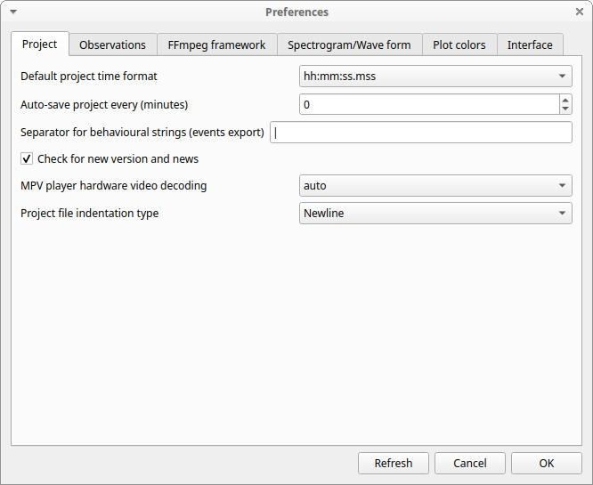
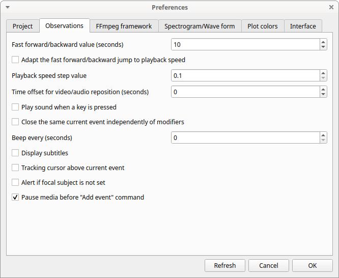
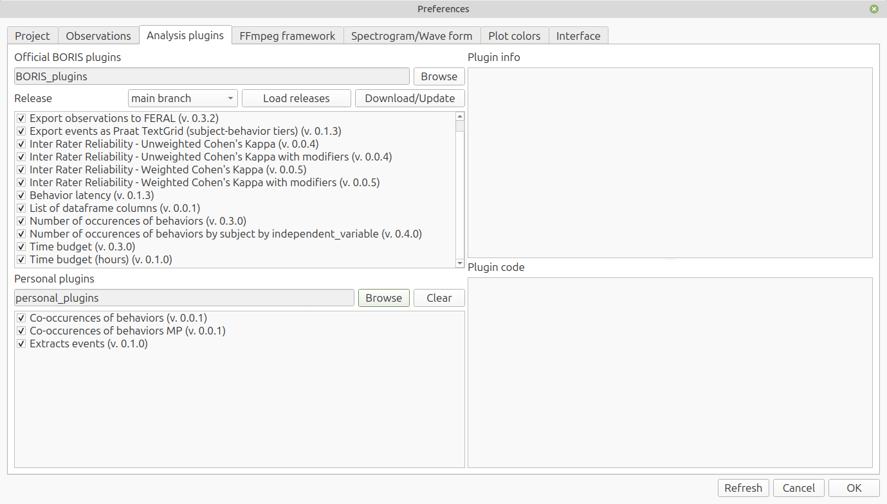
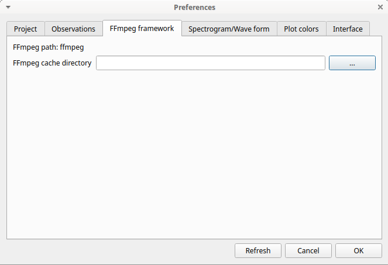
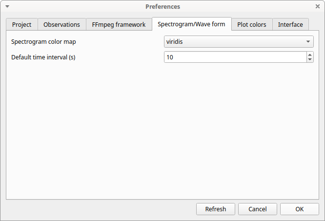
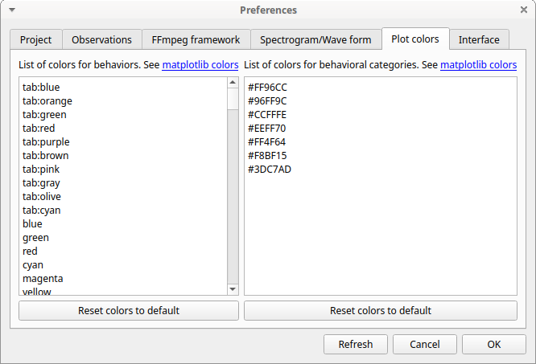
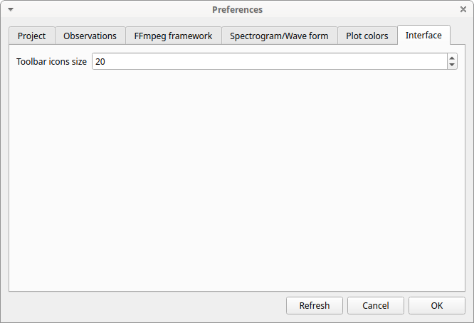

# Preferences

You can customize BORIS in the Preferences window
(**File** > **Preferences** or the **Preferences** button in the toolbar).

## Project preferences

**Default project time format**

:   This option allows you to choose the format used to display time
    in the project. Time is always stored internally in
    seconds with a precision of 3 decimal places.

**Auto-save project every (minutes)**

:   If set, BORIS will save your project automatically every n minutes. A value of 0
    disables automatic backup. The project will be saved only if it has
    already been saved and an observation is open.

**Separator for behavioural strings**

:   Character or string used to separate behaviors when exporting
    events as behavioral strings. See also Behatrix.

**Check for new version**

:   Checks for a new version on the BORIS website every 15 days (internet
    access required).

**MPV hardware video decoding**
:   If you experience problems with the embedded MPV player, try changing this value.

**Project file indentation type**
: The BORIS project file is encoded in JSON format. Choose the indentation style for the project file between:
  
  * None
  * Newline
  * Tab
  * 2 spaces
  * 4 spaces

**Refresh** button

:   Resets the configuration to the default values. BORIS will then close.

## Observations

**Fast forward/backward value (seconds)**
:   This option allows the user to customize the amount of time for "jumping" forward or backward in media.

**Adapt the fast for/backward jump to playback speed**
:   The jump value will be adapted to the playback speed.

**Playback speed step value**

:   This value indicates how much the speed will increase or
    decrease after pressing the *change playback speed* buttons.

**Time offset for media reposition (seconds)**

:   This value indicates the time offset used when repositioning the media
    after double-clicking an event row in the *Events* table. For
    example, `-4` means that after a double-click the media
    will be repositioned 4 seconds before the recorded event.

**Play sound when a key is pressed**

:   Plays a sound after each keypress event.

**Close the same current event independently of modifiers**

:   Stops the current behavior regardless of modifiers.

**Display subtitles**

:   Displays or hides subtitles. If subtitles are stored in a
    separate file, the subtitle file must have the same base
    name as the video file and use the `.srt` extension.

**Tracking cursor above current event**

:   Positions the tracking cursor above the current
    event in the events list table.

**Alert if focal subject is not set**

:   If this option is enabled, BORIS will show an alert box if no focal
    subject is selected.

**Pause media before "Add event" command**

:   Pauses the media before manually adding an event.

## Analysis plugins

**Personal plugins directory**

: Select the directory that contains the plugins to be loaded.

## FFmpeg framework

The path to the `ffmpeg` executable is displayed. The FFmpeg
executable is included with BORIS for Windows.
The FFmpeg framework is required to run BORIS.

**FFmpeg cache directory**
:   Indicates the directory that will be used as the image cache for
    frame-by-frame mode and spectrogram visualization. If you do not
    specify a path, BORIS will use the default temporary directory of
    your system.

## Spectrogram / wave form

{: style="width:666px"}

**Color map**
:   Selects the color map used to display the generated spectrogram.
  See [Matplotlib colormaps](http://matplotlib.org/users/colormaps.html) for details.

**Default time interval**
:   Selects the time interval, in seconds, used to display the spectrogram and waveform.

**Window type**
:   Selects the window type: Hanning, Hamming, or Blackmanharris.

**NFFT size**

**noverlap**

**Use vmin/vmax**

## Plot colors 

Behavior colors used in the plotting functions can be customized.
The first color will be associated to the first behavior in your
ethogram, the second color to the second behavior and so on. Various
color formats can be used to specify a color: **named color** or **hex
RGB** (like #0F0F0F). See <https://matplotlib.org/api/colors_api.html>
and <https://matplotlib.org/examples/color/named_colors.html> for
details.

The **reset colors to default** button will reload the default colors.

## Interface

{: style="width:666px"}

**Toolbar icons size**
:   Sets the size of the toolbar icons in pixels.
