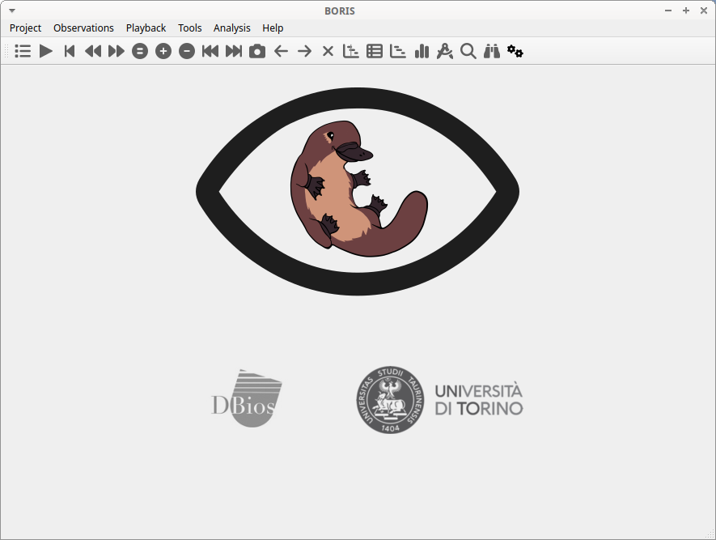

# Starting BORIS

Once BORIS is installed, it can be launched by clicking on its icon.

!!! warning "Warning for Windows users"

    BORIS does not yet use signed binaries which means that you will need to allow the execution of the downloaded executable. If there is no obvious way to do so, click on "More info" on the error message that shows up and then on "Run anyway".

!!! note "First launch"

    The initial launch of BORIS may take some time to display. Please be patient!

The main window of BORIS will appear. Currently, all commands on the toolbar are disabled, except for the Preferences button.

<figure markdown>
  
  <figcaption>The BORIS main window</figcaption>
</figure>

If you want to launch BORIS from the source code, refer to the [Run BORIS from source code](https://www.boris.unito.it/run_from_source_code) section.

