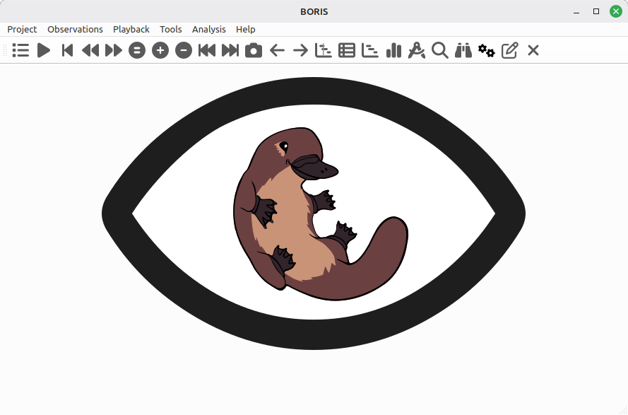

# Starting BORIS

Once BORIS is installed, it can be launched by clicking on its icon.

!!! warning "Warning for Windows users"

    BORIS does not yet use signed binaries, so you will need to allow the downloaded executable to run. If the option is not immediately visible, click "More info" in the warning dialog and then click "Run anyway".

!!! note "First launch"

    BORIS may take a little time to open the first time. Please be patient.

The BORIS main window will appear. At this stage, all toolbar commands are disabled except the Preferences button.

<figure markdown>
  
  <figcaption>The BORIS main window</figcaption>
</figure>

To launch BORIS from source code, refer to the [Run BORIS from source code](https://www.boris.unito.it/run_from_source_code) section.

