# Tools

## Media file

#### Media file information

Obtain information about your media file like duration, resolution, FPS, bitrate ...

#### Re-encode / resize video

BORIS can re-encode and resize your video files in order to reduce the
size of the files and have a smooth coding (specially with two video
files playing together). The re-encoding and resizing operations are
done with the embedded ffmpeg program with high quality parameters
(bitrate 2000k).

Select the files you want re-encode and resize and select the horizontal
resolution in pixels (the default is 1024). The aspect ratio will be
maintained.

You can continue to use BORIS during the re-encoding/resizing operation.

The re-encoded/resized video files are renamed by adding the re-encoded.avi extension to the original files.

#### Rotate video

BORIS can rotate your video files in order to code them using the right
view. The rotating operation is done with the embedded ffmpeg program
using the same quality parameters as the original video.

Select the files you want to rotate and select the rotation angle: **Rotate 90 clockwise**, **Rotate 90 counter clockwise**, or **Rotate 180**.

The aspect ratio will be maintained.

You can continue to use BORIS during the rotation operation.

The rotated video files are renamed by adding the **rotated\<ANGLE\>**
to the original file name.

#### Merge media files

Use this function to concatenate various media files together.

#### Create video spectrogram

Create a video with the spectrogram of the audio track

## Plot events in real-time

This function can be activated with **Tools** \> **Plot event in real time**.

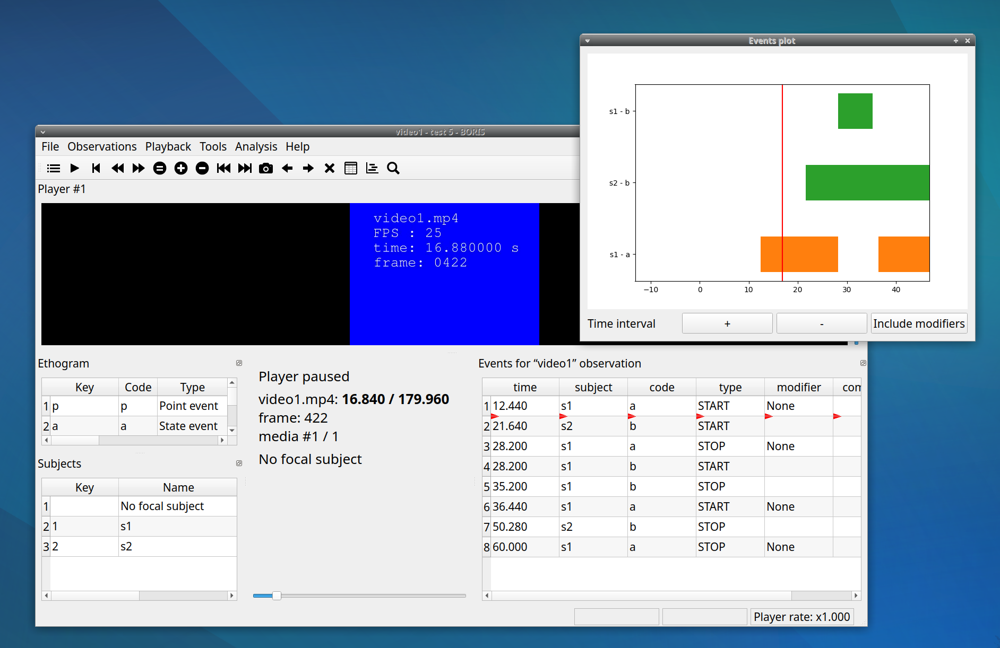

## :fontawesome-solid-compass-drafting: Geometric measurements

Several geometric measurements are available: **distances**, **areas**, and **angles** can be measured, and **point positions** can be recorded.

Click **Tools** \> **Geometric measurements** to activate the measurement tools.

<figure markdown>
  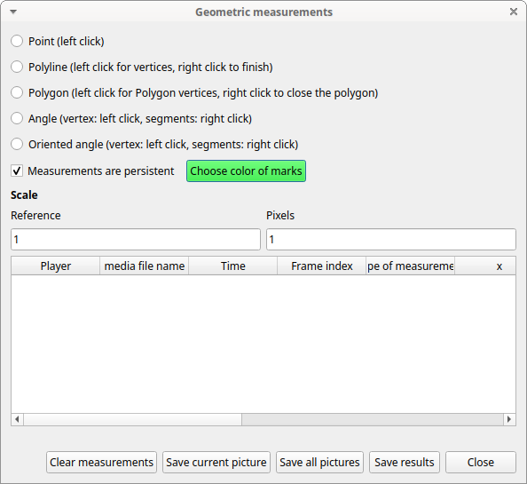{width="80.0%"}
  <figcaption>The geometric measurements window</figcaption>
</figure>

### Mark color

Use the **Choose color of marks** button to select a color. All marks will be drawn with the selected color.
The color transparency can be set using the **Alpha channel** value (0 for 100% transparent, 255 for a solid color).

<figure markdown>
  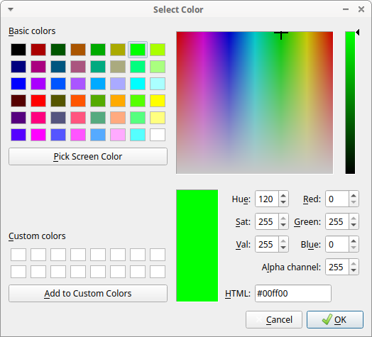{width="80.0%"}
  <figcaption>The color selection window</figcaption>
</figure>

### Setting the scale

For distance and area measurements, you can set a scale so that the
results are expressed in real units such as centimeters or meters.

<figure markdown>
  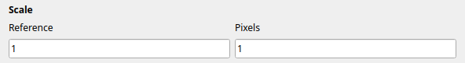{width="80.0%"}
  <figcaption>Setting the scale</figcaption>
</figure>

1.  Measure a reference object with a known size on the frame
    (with the distance tool; see the next section for details) and enter the
    pixel distance in the **Pixel** text box.

2.  Set the real size of the reference object in the **Reference** text
    box (must be a number without unit).

### Point

Select the **Point** radio button. Click the left mouse button on the video/image to record the position of the clicked pixel.

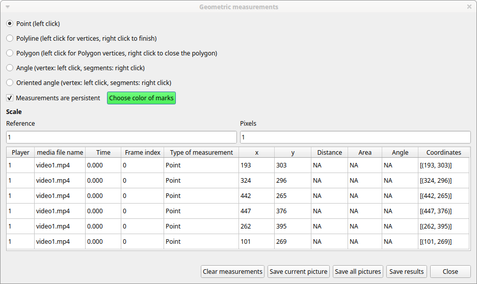

### Distance measurements

Select the **Distance** radio button. Click the left mouse button on the
frame bitmap to set the start of the segment that will be measured. A
circle with a cross will be drawn. Click the right mouse button to set
the end. A red circle with a cross will be drawn. The distance between
the two selected points will be available in the text area of the
**Measurements window**.

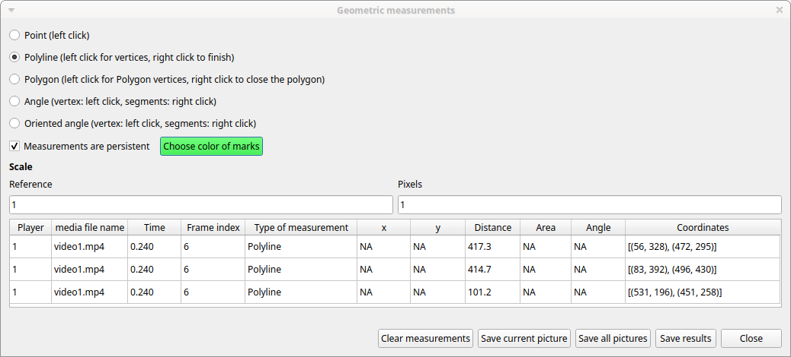

### Area measurements

Select the **Area** radio button. Click the left mouse button on the
frame bitmap to set the area vertices. Circles with a cross will be
drawn. Click the right mouse button to close the area. The area of the
drawn polygon will be available in the text area of the **Measurements
window**.

### Angle measurements

Select the **Angle** radio button. Click the left mouse button on the
frame bitmap to set the angle vertex. A red circle with a cross will be
drawn. Click the right mouse button to set the two segments. Circles
with a cross will be drawn. The angle between the two drawn segments
will be available in the text area of the **Measurements window**.

### Persistent measurements

If the **Measurements are persistent** checkbox is selected, the
measurement overlays will remain available on all frames; otherwise, they will
be cleared between frames.

The marks selected on other frames will be drawn in red.

## Coding pad

During an observation, a coding pad with the available behaviors can be
displayed (**Tools** \> **Coding pad**). This **Coding pad** allows you
to code using a touch screen or by clicking the buttons. When
the **Coding pad** is displayed, you can still code using the
keyboard or the ethogram.

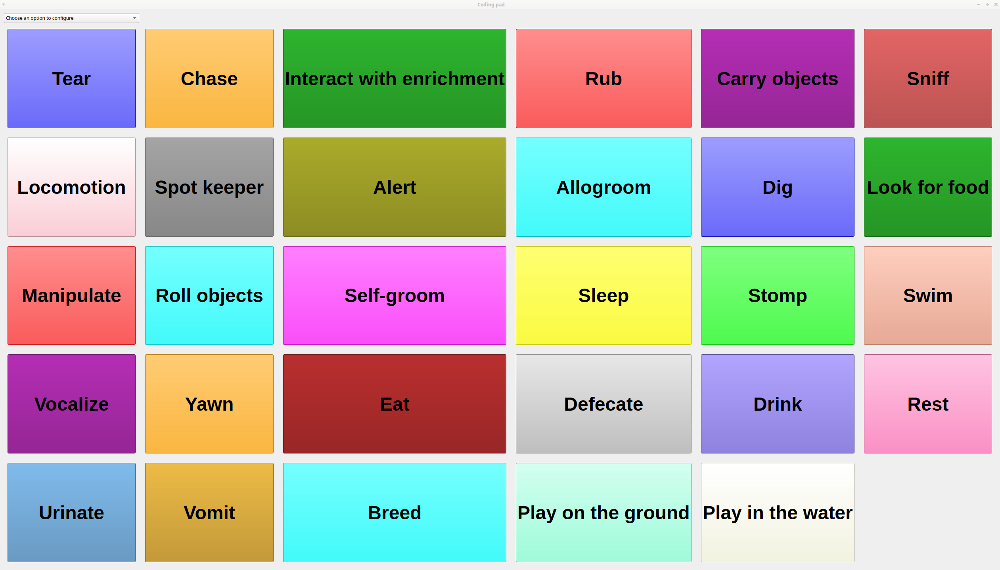

The button size can be increased or decreased.

Button colors can be set per behavior, per behavioral category, or disabled entirely.

See the drop-down list in the upper-left corner of the Coding pad window.

## Subjects pad

A pad with all defined subjects, or only filtered subjects, can be displayed
during the observation (**Tools** \> **Subjects pad**). This **Subjects
pad** allows you to select the focal subject using a touch screen
or by clicking the buttons. When the **Subjects pad** is displayed,
you can continue to select the focal subject using the keyboard or the
subjects list.

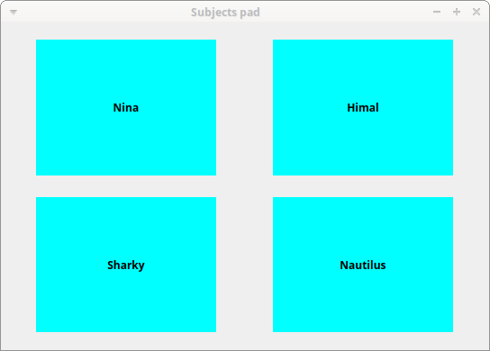{width="50.0%"}

## Transitions flow diagram

BORIS can generate DOT scripts and flow diagrams from the transitions
matrices (See Observations \> Create transition matrix for obtaining the
transitions matrices).

### DOT script (Graphviz language)

**Tools \> Transitions flow diagram \> Create transitions DOT script**

Choose one or more transition matrix files and BORIS will create the corresponding DOT script file(s).

The DOT script files can then be used with
[Graphviz](http://www.graphviz.org) (Graph Visualization Software) or
[WebGraphviz](http://www.webgraphviz.com) (Graphviz in the Browser) to
generate transition flow diagrams.

See [DOT (graph description
language)](https://en.wikipedia.org/wiki/DOT_(graph_description_language))
for details.

### Flow diagram

If [Graphviz](http://www.graphviz.org) (Graph Visualization Software) is
installed on your system (and the **dot** program available in the path),
BORIS can generate a flow diagram (PNG format) from a transition matrix
file.

**Tools \> Transitions flow diagram \> Create transitions flow diagram**

Choose one or more transition matrix files and BORIS will create the
corresponding flow diagrams.

### Flow diagram of frequencies of transitions

<figure markdown>
  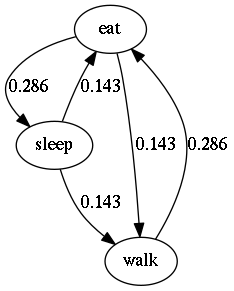{width="40.0%"}
  <figcaption>Frequencies of total transitions (the frequencies are plotted on the edges)</figcaption>
</figure>

### Flow diagram of frequencies of transitions after behavior

<figure markdown>
  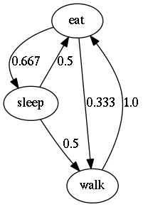{width="40.0%"}
  <figcaption>Frequencies of transitions after behavior (the frequencies are plotted on the edges)</figcaption>
</figure>

### Flow diagram of number of transitions

<figure markdown>
  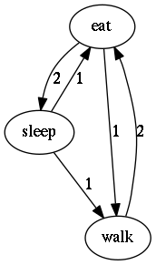{width="40.0%"}
  <figcaption>Number of transitions (the frequencies are plotted on the edges)</figcaption>
</figure>
