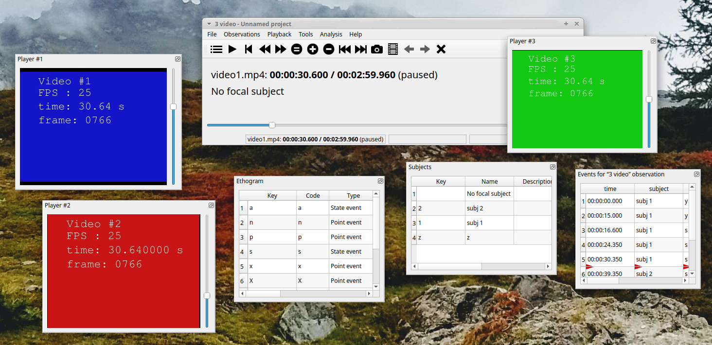
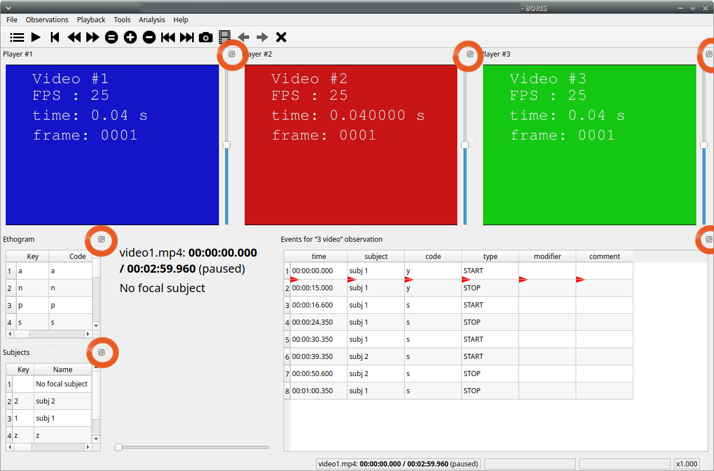
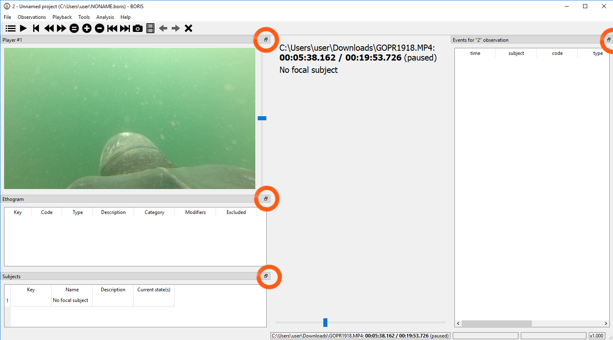
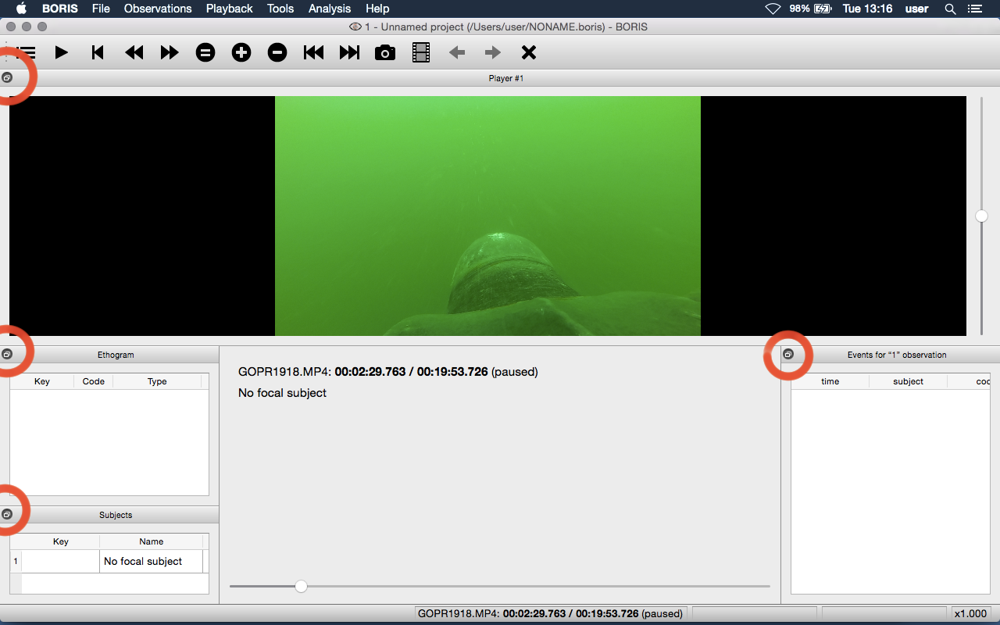

# Various

## Removing path of media files

With BORIS, you can choose to store the full path of media/data
files in the project file (for example:
`/home/user/Video/video_n1.mp4` or
`c:\Users\user\Documents\video1.avi`).

If you want to move your project to a different computer, or if you want
to move your media/data files, you may choose not to store the full
path. To do this, you can add media/data files using relative paths
(see the **Add media files** section). You can also remove the full path of
your media/data files from all observations in the current project
(**File** \> **Remove path from media files**). Please note that this
operation is irreversible. After removal, the full path of your media
will be lost and cannot be recovered.

**If you choose not to store the full path of media/data files, the
path of the media/data files must contain the path of your BORIS project
file.**

Example: if your BORIS project file is saved in
`/home/user/projects/test.project` your media/data files can be saved in
the `/home/user/projects/videos` directory but **NOT** in the
`/home/user/videos` directory.

## Docking / undocking graphical elements

All elements, including all media players, can be undocked from the
main window and positioned wherever you prefer (e.g. they can be on the
same desktop over one or many screens).

The position of the various widgets is saved in the [configuration
file](#configuration-files) at the end of the work session.

{width="1800px"}

Clicking the icon in the top-right corner of the widget (on macOS,
the icon is located in the top-left corner) undocks the widget so that it
can be repositioned in another docking area or moved outside the main
window. Double-clicking the top bar of the widget docks it back into
the main window.

For Linux:

{width="100.0%"}

For Microsoft-Windows:

{width="100.0%"}

For MacOS:

{width="100.0%"}

If you prefer not to move dock widgets, you can lock them in the
main window by enabling **Lock dockwidgets** (see **Tools**
\> **Lock dockwidgets**). All dock widgets will be docked in the main
window and locked on it except the player dockwidgets.

## Configuration files

BORIS saves the configuration (user preferences, window positions,
widget positions) in a configuration file named **.boris**,
stored in the home directory of the current user:

    for Linux:
    /home/USERNAME/.boris

    for Microsoft-Windows:
    C:\Users\USERNAME\.boris

    for MacOS:
    /Users/USERNAME/.boris

If you have trouble using BORIS, try closing the program, deleting
this file and relaunch BORIS.

The **recent projects list** is saved in the
**.boris\_recent\_projects** file in the home directory of the current
user.

## Lock the dockwidgets

The dockwidgets (except the player dockwidgets) can be locked on the
main window (See **Tools** \> **Lock dockwidgets**).

## Valid keys for triggering behavior

BORIS distinguishes between lowercase and uppercase characters.

* keys from a to z
* keys from A to Z
* keys from 0 to 9
* function keys from F1 to F12
* à é è ù ì ç
* ! " £ $ % & / ( ) = ? ^ [ ] { } @ | § ° #
